## Autogenerated
### Priors
| model | wm0 | A_a | A_l | A_s | A_aa | A_al | A_as | A_ll | A_ll_g | A_ls | A_ss | A_aaa | A_aal | A_aas | A_all | A_als | A_ass | A_lll | A_lll_g | A_lll_gg | A_lls | A_lls_g | A_lss | A_sss | A_alpha |
| --- | --- | --- | --- | --- | --- | --- | --- | --- | --- | --- | --- | --- | --- | --- | --- | --- | --- | --- | --- | --- | --- | --- | --- | --- | --- |
| default_mO | 1.0(1.0) | -0.5(1.0) | 2.0(2.0) | 2.0(2.0) | 0.0(1.0) | 0.0(2.0) | 0.0(4.0) | 0.0(4.0) | 0.0(4.0) | 0.0(4.0) | 0.0(4.0) | 0.0(1.0) | 0.0(2.0) | 0.0(2.0) | 0.0(4.0) | 0.0(4.0) | 0.0(4.0) | 0.0(8.0) | 0.0(8.0) | 0.0(8.0) | 0.0(8.0) | 0.0(8.0) | 0.0(8.0) | 0.0(8.0) | 0.00(70) |
| default_Fpi | 1.0(1.0) | -0.5(1.0) | 1.0(1.0) | 1.0(1.0) | 0.0(1.0) | 0.0(1.0) | 0.0(1.0) | 0.0(1.0) | 0.0(1.0) | 0.0(1.0) | 0.0(1.0) | 0.0(1.0) | 0.0(1.0) | 0.0(1.0) | 0.0(1.0) | 0.0(1.0) | 0.0(1.0) | 0.0(1.0) | 0.0(1.0) | 0.0(1.0) | 0.0(1.0) | 0.0(1.0) | 0.0(1.0) | 0.0(1.0) | 0.00(70) |
| Fpi_n2lo | 1.0(1.0) | -0.5(1.0) | 1.0(1.0) | 1.0(1.0) | 0.0(1.0) | 0.0(1.0) | 0.0(1.0) | 0.0(1.0) | 0.0(1.0) | 0.0(1.0) | 0.0(1.0) | 0.0(1.0) | 0.0(1.0) | 0.0(1.0) | 0.0(1.0) | 0.0(1.0) | 0.0(1.0) | 0.0(1.0) | 0.0(1.0) | 0.0(1.0) | 0.0(1.0) | 0.0(1.0) | 0.0(1.0) | 0.0(1.0) | 0.00(70) |
| Fpi_n2lo_alphas | 1.0(1.0) | -0.5(1.0) | 1.0(1.0) | 1.0(1.0) | 0.0(1.0) | 0.0(1.0) | 0.0(1.0) | 0.0(1.0) | 0.0(1.0) | 0.0(1.0) | 0.0(1.0) | 0.0(1.0) | 0.0(1.0) | 0.0(1.0) | 0.0(1.0) | 0.0(1.0) | 0.0(1.0) | 0.0(1.0) | 0.0(1.0) | 0.0(1.0) | 0.0(1.0) | 0.0(1.0) | 0.0(1.0) | 0.0(1.0) | 0.00(70) |
| Fpi_n2lo_alphas_fv | 1.0(1.0) | -0.5(1.0) | 1.0(1.0) | 1.0(1.0) | 0.0(1.0) | 0.0(1.0) | 0.0(1.0) | 0.0(1.0) | 0.0(1.0) | 0.0(1.0) | 0.0(1.0) | 0.0(1.0) | 0.0(1.0) | 0.0(1.0) | 0.0(1.0) | 0.0(1.0) | 0.0(1.0) | 0.0(1.0) | 0.0(1.0) | 0.0(1.0) | 0.0(1.0) | 0.0(1.0) | 0.0(1.0) | 0.0(1.0) | 0.00(70) |
| Fpi_n2lo_fv | 1.0(1.0) | -0.5(1.0) | 1.0(1.0) | 1.0(1.0) | 0.0(1.0) | 0.0(1.0) | 0.0(1.0) | 0.0(1.0) | 0.0(1.0) | 0.0(1.0) | 0.0(1.0) | 0.0(1.0) | 0.0(1.0) | 0.0(1.0) | 0.0(1.0) | 0.0(1.0) | 0.0(1.0) | 0.0(1.0) | 0.0(1.0) | 0.0(1.0) | 0.0(1.0) | 0.0(1.0) | 0.0(1.0) | 0.0(1.0) | 0.00(70) |
| Fpi_n2lo_log | 1.0(1.0) | -0.5(1.0) | 1.0(1.0) | 1.0(1.0) | 0.0(1.0) | 0.0(1.0) | 0.0(1.0) | 0.0(1.0) | 0.0(1.0) | 0.0(1.0) | 0.0(1.0) | 0.0(1.0) | 0.0(1.0) | 0.0(1.0) | 0.0(1.0) | 0.0(1.0) | 0.0(1.0) | 0.0(1.0) | 0.0(1.0) | 0.0(1.0) | 0.0(1.0) | 0.0(1.0) | 0.0(1.0) | 0.0(1.0) | 0.00(70) |
| Fpi_n2lo_log_alphas | 1.0(1.0) | -0.5(1.0) | 1.0(1.0) | 1.0(1.0) | 0.0(1.0) | 0.0(1.0) | 0.0(1.0) | 0.0(1.0) | 0.0(1.0) | 0.0(1.0) | 0.0(1.0) | 0.0(1.0) | 0.0(1.0) | 0.0(1.0) | 0.0(1.0) | 0.0(1.0) | 0.0(1.0) | 0.0(1.0) | 0.0(1.0) | 0.0(1.0) | 0.0(1.0) | 0.0(1.0) | 0.0(1.0) | 0.0(1.0) | 0.00(70) |
| Fpi_n2lo_log_alphas_fv | 1.0(1.0) | -0.5(1.0) | 1.0(1.0) | 1.0(1.0) | 0.0(1.0) | 0.0(1.0) | 0.0(1.0) | 0.0(1.0) | 0.0(1.0) | 0.0(1.0) | 0.0(1.0) | 0.0(1.0) | 0.0(1.0) | 0.0(1.0) | 0.0(1.0) | 0.0(1.0) | 0.0(1.0) | 0.0(1.0) | 0.0(1.0) | 0.0(1.0) | 0.0(1.0) | 0.0(1.0) | 0.0(1.0) | 0.0(1.0) | 0.00(70) |
| Fpi_n2lo_log_fv | 1.0(1.0) | -0.5(1.0) | 1.0(1.0) | 1.0(1.0) | 0.0(1.0) | 0.0(1.0) | 0.0(1.0) | 0.0(1.0) | 0.0(1.0) | 0.0(1.0) | 0.0(1.0) | 0.0(1.0) | 0.0(1.0) | 0.0(1.0) | 0.0(1.0) | 0.0(1.0) | 0.0(1.0) | 0.0(1.0) | 0.0(1.0) | 0.0(1.0) | 0.0(1.0) | 0.0(1.0) | 0.0(1.0) | 0.0(1.0) | 0.00(70) |
| Fpi_n3lo | 1.0(1.0) | -0.5(1.0) | 1.0(1.0) | 1.0(1.0) | 0.0(1.0) | 0.0(1.0) | 0.0(1.0) | 0.0(1.0) | 0.0(1.0) | 0.0(1.0) | 0.0(1.0) | 0.0(1.0) | 0.0(1.0) | 0.0(1.0) | 0.0(1.0) | 0.0(1.0) | 0.0(1.0) | 0.0(1.0) | 0.0(1.0) | 0.0(1.0) | 0.0(1.0) | 0.0(1.0) | 0.0(1.0) | 0.0(1.0) | 0.00(70) |
| Fpi_n3lo_alphas | 1.0(1.0) | -0.5(1.0) | 1.0(1.0) | 1.0(1.0) | 0.0(1.0) | 0.0(1.0) | 0.0(1.0) | 0.0(1.0) | 0.0(1.0) | 0.0(1.0) | 0.0(1.0) | 0.0(1.0) | 0.0(1.0) | 0.0(1.0) | 0.0(1.0) | 0.0(1.0) | 0.0(1.0) | 0.0(1.0) | 0.0(1.0) | 0.0(1.0) | 0.0(1.0) | 0.0(1.0) | 0.0(1.0) | 0.0(1.0) | 0.00(70) |
| Fpi_n3lo_alphas_fv | 1.0(1.0) | -0.5(1.0) | 1.0(1.0) | 1.0(1.0) | 0.0(1.0) | 0.0(1.0) | 0.0(1.0) | 0.0(1.0) | 0.0(1.0) | 0.0(1.0) | 0.0(1.0) | 0.0(1.0) | 0.0(1.0) | 0.0(1.0) | 0.0(1.0) | 0.0(1.0) | 0.0(1.0) | 0.0(1.0) | 0.0(1.0) | 0.0(1.0) | 0.0(1.0) | 0.0(1.0) | 0.0(1.0) | 0.0(1.0) | 0.00(70) |
| Fpi_n3lo_fv | 1.0(1.0) | -0.5(1.0) | 1.0(1.0) | 1.0(1.0) | 0.0(1.0) | 0.0(1.0) | 0.0(1.0) | 0.0(1.0) | 0.0(1.0) | 0.0(1.0) | 0.0(1.0) | 0.0(1.0) | 0.0(1.0) | 0.0(1.0) | 0.0(1.0) | 0.0(1.0) | 0.0(1.0) | 0.0(1.0) | 0.0(1.0) | 0.0(1.0) | 0.0(1.0) | 0.0(1.0) | 0.0(1.0) | 0.0(1.0) | 0.00(70) |
| Fpi_n3lo_log_log2 | 1.0(1.0) | -0.5(1.0) | 1.0(1.0) | 1.0(1.0) | 0.0(1.0) | 0.0(1.0) | 0.0(1.0) | 0.0(1.0) | 0.0(1.0) | 0.0(1.0) | 0.0(1.0) | 0.0(1.0) | 0.0(1.0) | 0.0(1.0) | 0.0(1.0) | 0.0(1.0) | 0.0(1.0) | 0.0(1.0) | 0.0(1.0) | 0.0(1.0) | 0.0(1.0) | 0.0(1.0) | 0.0(1.0) | 0.0(1.0) | 0.00(70) |
| Fpi_n3lo_log_log2_alphas | 1.0(1.0) | -0.5(1.0) | 1.0(1.0) | 1.0(1.0) | 0.0(1.0) | 0.0(1.0) | 0.0(1.0) | 0.0(1.0) | 0.0(1.0) | 0.0(1.0) | 0.0(1.0) | 0.0(1.0) | 0.0(1.0) | 0.0(1.0) | 0.0(1.0) | 0.0(1.0) | 0.0(1.0) | 0.0(1.0) | 0.0(1.0) | 0.0(1.0) | 0.0(1.0) | 0.0(1.0) | 0.0(1.0) | 0.0(1.0) | 0.00(70) |
| Fpi_n3lo_log_log2_alphas_fv | 1.0(1.0) | -0.5(1.0) | 1.0(1.0) | 1.0(1.0) | 0.0(1.0) | 0.0(1.0) | 0.0(1.0) | 0.0(1.0) | 0.0(1.0) | 0.0(1.0) | 0.0(1.0) | 0.0(1.0) | 0.0(1.0) | 0.0(1.0) | 0.0(1.0) | 0.0(1.0) | 0.0(1.0) | 0.0(1.0) | 0.0(1.0) | 0.0(1.0) | 0.0(1.0) | 0.0(1.0) | 0.0(1.0) | 0.0(1.0) | 0.00(70) |
| Fpi_n3lo_log_log2_fv | 1.0(1.0) | -0.5(1.0) | 1.0(1.0) | 1.0(1.0) | 0.0(1.0) | 0.0(1.0) | 0.0(1.0) | 0.0(1.0) | 0.0(1.0) | 0.0(1.0) | 0.0(1.0) | 0.0(1.0) | 0.0(1.0) | 0.0(1.0) | 0.0(1.0) | 0.0(1.0) | 0.0(1.0) | 0.0(1.0) | 0.0(1.0) | 0.0(1.0) | 0.0(1.0) | 0.0(1.0) | 0.0(1.0) | 0.0(1.0) | 0.00(70) |
| Om_n2lo | 1.0(1.0) | -0.5(1.0) | 2.0(2.0) | 2.0(2.0) | 0.0(1.0) | 0.0(2.0) | 0.0(4.0) | 0.0(4.0) | 0.0(4.0) | 0.0(4.0) | 0.0(4.0) | 0.0(1.0) | 0.0(2.0) | 0.0(2.0) | 0.0(4.0) | 0.0(4.0) | 0.0(4.0) | 0.0(8.0) | 0.0(8.0) | 0.0(8.0) | 0.0(8.0) | 0.0(8.0) | 0.0(8.0) | 0.0(8.0) | 0.00(70) |
| Om_n2lo_alphas | 1.0(1.0) | -0.5(1.0) | 2.0(2.0) | 2.0(2.0) | 0.0(1.0) | 0.0(2.0) | 0.0(4.0) | 0.0(4.0) | 0.0(4.0) | 0.0(4.0) | 0.0(4.0) | 0.0(1.0) | 0.0(2.0) | 0.0(2.0) | 0.0(4.0) | 0.0(4.0) | 0.0(4.0) | 0.0(8.0) | 0.0(8.0) | 0.0(8.0) | 0.0(8.0) | 0.0(8.0) | 0.0(8.0) | 0.0(8.0) | 0.00(70) |
| Om_n2lo_alphas_fv | 1.0(1.0) | -0.5(1.0) | 2.0(2.0) | 2.0(2.0) | 0.0(1.0) | 0.0(2.0) | 0.0(4.0) | 0.0(4.0) | 0.0(4.0) | 0.0(4.0) | 0.0(4.0) | 0.0(1.0) | 0.0(2.0) | 0.0(2.0) | 0.0(4.0) | 0.0(4.0) | 0.0(4.0) | 0.0(8.0) | 0.0(8.0) | 0.0(8.0) | 0.0(8.0) | 0.0(8.0) | 0.0(8.0) | 0.0(8.0) | 0.00(70) |
| Om_n2lo_fv | 1.0(1.0) | -0.5(1.0) | 2.0(2.0) | 2.0(2.0) | 0.0(1.0) | 0.0(2.0) | 0.0(4.0) | 0.0(4.0) | 0.0(4.0) | 0.0(4.0) | 0.0(4.0) | 0.0(1.0) | 0.0(2.0) | 0.0(2.0) | 0.0(4.0) | 0.0(4.0) | 0.0(4.0) | 0.0(8.0) | 0.0(8.0) | 0.0(8.0) | 0.0(8.0) | 0.0(8.0) | 0.0(8.0) | 0.0(8.0) | 0.00(70) |
| Om_n2lo_log | 1.0(1.0) | -0.5(1.0) | 2.0(2.0) | 2.0(2.0) | 0.0(1.0) | 0.0(2.0) | 0.0(4.0) | 0.0(4.0) | 0.0(4.0) | 0.0(4.0) | 0.0(4.0) | 0.0(1.0) | 0.0(2.0) | 0.0(2.0) | 0.0(4.0) | 0.0(4.0) | 0.0(4.0) | 0.0(8.0) | 0.0(8.0) | 0.0(8.0) | 0.0(8.0) | 0.0(8.0) | 0.0(8.0) | 0.0(8.0) | 0.00(70) |
| Om_n2lo_log_alphas | 1.0(1.0) | -0.5(1.0) | 2.0(2.0) | 2.0(2.0) | 0.0(1.0) | 0.0(2.0) | 0.0(4.0) | 0.0(4.0) | 0.0(4.0) | 0.0(4.0) | 0.0(4.0) | 0.0(1.0) | 0.0(2.0) | 0.0(2.0) | 0.0(4.0) | 0.0(4.0) | 0.0(4.0) | 0.0(8.0) | 0.0(8.0) | 0.0(8.0) | 0.0(8.0) | 0.0(8.0) | 0.0(8.0) | 0.0(8.0) | 0.00(70) |
| Om_n2lo_log_alphas_fv | 1.0(1.0) | -0.5(1.0) | 2.0(2.0) | 2.0(2.0) | 0.0(1.0) | 0.0(2.0) | 0.0(4.0) | 0.0(4.0) | 0.0(4.0) | 0.0(4.0) | 0.0(4.0) | 0.0(1.0) | 0.0(2.0) | 0.0(2.0) | 0.0(4.0) | 0.0(4.0) | 0.0(4.0) | 0.0(8.0) | 0.0(8.0) | 0.0(8.0) | 0.0(8.0) | 0.0(8.0) | 0.0(8.0) | 0.0(8.0) | 0.00(70) |
| Om_n2lo_log_fv | 1.0(1.0) | -0.5(1.0) | 2.0(2.0) | 2.0(2.0) | 0.0(1.0) | 0.0(2.0) | 0.0(4.0) | 0.0(4.0) | 0.0(4.0) | 0.0(4.0) | 0.0(4.0) | 0.0(1.0) | 0.0(2.0) | 0.0(2.0) | 0.0(4.0) | 0.0(4.0) | 0.0(4.0) | 0.0(8.0) | 0.0(8.0) | 0.0(8.0) | 0.0(8.0) | 0.0(8.0) | 0.0(8.0) | 0.0(8.0) | 0.00(70) |
| Om_n3lo | 1.0(1.0) | -0.5(1.0) | 2.0(2.0) | 2.0(2.0) | 0.0(1.0) | 0.0(2.0) | 0.0(4.0) | 0.0(4.0) | 0.0(4.0) | 0.0(4.0) | 0.0(4.0) | 0.0(1.0) | 0.0(2.0) | 0.0(2.0) | 0.0(4.0) | 0.0(4.0) | 0.0(4.0) | 0.0(8.0) | 0.0(8.0) | 0.0(8.0) | 0.0(8.0) | 0.0(8.0) | 0.0(8.0) | 0.0(8.0) | 0.00(70) |
| Om_n3lo_alphas | 1.0(1.0) | -0.5(1.0) | 2.0(2.0) | 2.0(2.0) | 0.0(1.0) | 0.0(2.0) | 0.0(4.0) | 0.0(4.0) | 0.0(4.0) | 0.0(4.0) | 0.0(4.0) | 0.0(1.0) | 0.0(2.0) | 0.0(2.0) | 0.0(4.0) | 0.0(4.0) | 0.0(4.0) | 0.0(8.0) | 0.0(8.0) | 0.0(8.0) | 0.0(8.0) | 0.0(8.0) | 0.0(8.0) | 0.0(8.0) | 0.00(70) |
| Om_n3lo_alphas_fv | 1.0(1.0) | -0.5(1.0) | 2.0(2.0) | 2.0(2.0) | 0.0(1.0) | 0.0(2.0) | 0.0(4.0) | 0.0(4.0) | 0.0(4.0) | 0.0(4.0) | 0.0(4.0) | 0.0(1.0) | 0.0(2.0) | 0.0(2.0) | 0.0(4.0) | 0.0(4.0) | 0.0(4.0) | 0.0(8.0) | 0.0(8.0) | 0.0(8.0) | 0.0(8.0) | 0.0(8.0) | 0.0(8.0) | 0.0(8.0) | 0.00(70) |
| Om_n3lo_fv | 1.0(1.0) | -0.5(1.0) | 2.0(2.0) | 2.0(2.0) | 0.0(1.0) | 0.0(2.0) | 0.0(4.0) | 0.0(4.0) | 0.0(4.0) | 0.0(4.0) | 0.0(4.0) | 0.0(1.0) | 0.0(2.0) | 0.0(2.0) | 0.0(4.0) | 0.0(4.0) | 0.0(4.0) | 0.0(8.0) | 0.0(8.0) | 0.0(8.0) | 0.0(8.0) | 0.0(8.0) | 0.0(8.0) | 0.0(8.0) | 0.00(70) |
| Om_n3lo_log_log2 | 1.0(1.0) | -0.5(1.0) | 2.0(2.0) | 2.0(2.0) | 0.0(1.0) | 0.0(2.0) | 0.0(4.0) | 0.0(4.0) | 0.0(4.0) | 0.0(4.0) | 0.0(4.0) | 0.0(1.0) | 0.0(2.0) | 0.0(2.0) | 0.0(4.0) | 0.0(4.0) | 0.0(4.0) | 0.0(8.0) | 0.0(8.0) | 0.0(8.0) | 0.0(8.0) | 0.0(8.0) | 0.0(8.0) | 0.0(8.0) | 0.00(70) |
| Om_n3lo_log_log2_alphas | 1.0(1.0) | -0.5(1.0) | 2.0(2.0) | 2.0(2.0) | 0.0(1.0) | 0.0(2.0) | 0.0(4.0) | 0.0(4.0) | 0.0(4.0) | 0.0(4.0) | 0.0(4.0) | 0.0(1.0) | 0.0(2.0) | 0.0(2.0) | 0.0(4.0) | 0.0(4.0) | 0.0(4.0) | 0.0(8.0) | 0.0(8.0) | 0.0(8.0) | 0.0(8.0) | 0.0(8.0) | 0.0(8.0) | 0.0(8.0) | 0.00(70) |
| Om_n3lo_log_log2_alphas_fv | 1.0(1.0) | -0.5(1.0) | 2.0(2.0) | 2.0(2.0) | 0.0(1.0) | 0.0(2.0) | 0.0(4.0) | 0.0(4.0) | 0.0(4.0) | 0.0(4.0) | 0.0(4.0) | 0.0(1.0) | 0.0(2.0) | 0.0(2.0) | 0.0(4.0) | 0.0(4.0) | 0.0(4.0) | 0.0(8.0) | 0.0(8.0) | 0.0(8.0) | 0.0(8.0) | 0.0(8.0) | 0.0(8.0) | 0.0(8.0) | 0.00(70) |
| Om_n3lo_log_log2_fv | 1.0(1.0) | -0.5(1.0) | 2.0(2.0) | 2.0(2.0) | 0.0(1.0) | 0.0(2.0) | 0.0(4.0) | 0.0(4.0) | 0.0(4.0) | 0.0(4.0) | 0.0(4.0) | 0.0(1.0) | 0.0(2.0) | 0.0(2.0) | 0.0(4.0) | 0.0(4.0) | 0.0(4.0) | 0.0(8.0) | 0.0(8.0) | 0.0(8.0) | 0.0(8.0) | 0.0(8.0) | 0.0(8.0) | 0.0(8.0) | 0.00(70) |

### Model List
| model | chiral_cutoff | exclude | include_alphas | include_fv | include_log | include_log2 | latt_ct | order |
| --- | --- | --- | --- | --- | --- | --- | --- | --- |
| Fpi_n2lo | Fpi | [] | False | False | False | False | n2lo | n2lo |
| Fpi_n2lo_alphas | Fpi | [] | True | False | False | False | n2lo | n2lo |
| Fpi_n2lo_alphas_fv | Fpi | [] | True | True | False | False | n2lo | n2lo |
| Fpi_n2lo_fv | Fpi | [] | False | True | False | False | n2lo | n2lo |
| Fpi_n2lo_log | Fpi | [] | False | False | True | False | n2lo | n2lo |
| Fpi_n2lo_log_alphas | Fpi | [] | True | False | True | False | n2lo | n2lo |
| Fpi_n2lo_log_alphas_fv | Fpi | [] | True | True | True | False | n2lo | n2lo |
| Fpi_n2lo_log_fv | Fpi | [] | False | True | True | False | n2lo | n2lo |
| Fpi_n3lo | Fpi | [] | False | False | False | False | n3lo | n3lo |
| Fpi_n3lo_alphas | Fpi | [] | True | False | False | False | n3lo | n3lo |
| Fpi_n3lo_alphas_fv | Fpi | [] | True | True | False | False | n3lo | n3lo |
| Fpi_n3lo_fv | Fpi | [] | False | True | False | False | n3lo | n3lo |
| Fpi_n3lo_log_log2 | Fpi | [] | False | False | True | True | n3lo | n3lo |
| Fpi_n3lo_log_log2_alphas | Fpi | [] | True | False | True | True | n3lo | n3lo |
| Fpi_n3lo_log_log2_alphas_fv | Fpi | [] | True | True | True | True | n3lo | n3lo |
| Fpi_n3lo_log_log2_fv | Fpi | [] | False | True | True | True | n3lo | n3lo |
| Om_n2lo | mO | [] | False | False | False | False | n2lo | n2lo |
| Om_n2lo_alphas | mO | [] | True | False | False | False | n2lo | n2lo |
| Om_n2lo_alphas_fv | mO | [] | True | True | False | False | n2lo | n2lo |
| Om_n2lo_fv | mO | [] | False | True | False | False | n2lo | n2lo |
| Om_n2lo_log | mO | [] | False | False | True | False | n2lo | n2lo |
| Om_n2lo_log_alphas | mO | [] | True | False | True | False | n2lo | n2lo |
| Om_n2lo_log_alphas_fv | mO | [] | True | True | True | False | n2lo | n2lo |
| Om_n2lo_log_fv | mO | [] | False | True | True | False | n2lo | n2lo |
| Om_n3lo | mO | [] | False | False | False | False | n3lo | n3lo |
| Om_n3lo_alphas | mO | [] | True | False | False | False | n3lo | n3lo |
| Om_n3lo_alphas_fv | mO | [] | True | True | False | False | n3lo | n3lo |
| Om_n3lo_fv | mO | [] | False | True | False | False | n3lo | n3lo |
| Om_n3lo_log_log2 | mO | [] | False | False | True | True | n3lo | n3lo |
| Om_n3lo_log_log2_alphas | mO | [] | True | False | True | True | n3lo | n3lo |
| Om_n3lo_log_log2_alphas_fv | mO | [] | True | True | True | True | n3lo | n3lo |
| Om_n3lo_log_log2_fv | mO | [] | False | True | True | True | n3lo | n3lo |

### Inputs
| ens | Fpi | L | a/w | alpha_s | mO | mk | mpi |
| --- | --- | --- | --- | --- | --- | --- | --- |
| a06m310L | 0.030366(83) | 72 | 0.34533(24) | 0.29985 | 0.5069(21) | 0.162049(73) | 0.094560(58) |
| a09m135 | 0.04079(10) | 64 | 0.51414(26) | 0.43356 | 0.7244(25) | 0.218500(78) | 0.059459(63) |
| a09m220 | 0.042843(79) | 48 | 0.51862(32) | 0.43356 | 0.7377(30) | 0.228702(91) | 0.097900(63) |
| a09m310 | 0.045523(68) | 32 | 0.52701(53) | 0.43356 | 0.7543(36) | 0.24106(14) | 0.14072(12) |
| a09m350 | 0.046632(84) | 32 | 0.53160(76) | 0.43356 | 0.7561(35) | 0.24696(12) | 0.15785(20) |
| a09m400 | 0.048368(75) | 32 | 0.53761(61) | 0.43356 | 0.7716(23) | 0.25523(13) | 0.18116(15) |
| a12m130 | 0.05701(11) | 48 | 0.70646(25) | 0.53796 | 0.9801(26) | 0.30215(11) | 0.08126(16) |
| a12m180L | 0.05781(11) | 48 | 0.70958(22) | 0.53796 | 0.9924(26) | 0.305937(89) | 0.109624(59) |
| a12m220 | 0.05870(13) | 32 | 0.71190(51) | 0.53796 | 0.9924(60) | 0.31001(17) | 0.13428(17) |
| a12m220L | 0.05881(13) | 40 | 0.71220(32) | 0.53796 | 0.9944(30) | 0.31021(19) | 0.13402(15) |
| a12m220S | 0.05865(16) | 24 | 0.71322(76) | 0.53796 | 0.9970(26) | 0.31043(22) | 0.13557(32) |
| a12m220ms | 0.05732(11) | 32 | 0.69740(58) | 0.53796 | 0.8896(92) | 0.24639(13) | 0.13282(13) |
| a12m310 | 0.06138(11) | 24 | 0.72307(68) | 0.53796 | 1.0112(32) | 0.32414(21) | 0.18870(17) |
| a12m310XL | 0.06176(12) | 48 | 0.72303(28) | 0.53796 | 1.0072(41) | 0.324608(91) | 0.188574(81) |
| a12m350 | 0.06299(14) | 24 | 0.72846(53) | 0.53796 | 1.0139(26) | 0.33306(16) | 0.21397(20) |
| a12m400 | 0.06498(11) | 24 | 0.73442(46) | 0.53796 | 1.0279(25) | 0.34341(14) | 0.24347(16) |
| a15m135XL | 0.07131(11) | 48 | 0.87473(23) | 0.58801 | 1.2081(19) | 0.38755(14) | 0.102929(69) |
| a15m220 | 0.072768(84) | 24 | 0.87890(53) | 0.58801 | 1.2068(26) | 0.38690(21) | 0.16533(19) |
| a15m310 | 0.075290(89) | 16 | 0.89058(76) | 0.58801 | 1.2312(36) | 0.40457(25) | 0.23601(29) |
| a15m310L | 0.07594(14) | 24 | 0.89138(56) | 0.58801 | 1.2287(31) | 0.40408(22) | 0.23411(21) |
| a15m350 | 0.07690(11) | 16 | 0.89654(88) | 0.58801 | 1.2331(31) | 0.41369(28) | 0.26473(30) |
| a15m400 | 0.07938(12) | 16 | 0.90465(98) | 0.58801 | 1.2437(43) | 0.42723(27) | 0.30281(31) |

### Model Average
```yaml
w0: 0.1711(12)

---
Uncertainty: 
   RMS model sdev:   0.00119 
   Model unc:        0.00024 

---
Error budget (rms model sdev): 
   Statistical:  0.00093 
   Chiral:       0.00017 
   Disc:         0.00061 
   Phys point:   0.00031 

---
Highest Weight: 
   0.080:  Fpi_n3lo_log_log2_alphas
   0.078:  Fpi_n3lo_log_log2
   0.076:  Fpi_n3lo_log_log2_alphas_fv
   0.075:  Fpi_n3lo_alphas
   0.075:  Fpi_n3lo_alphas_fv
```
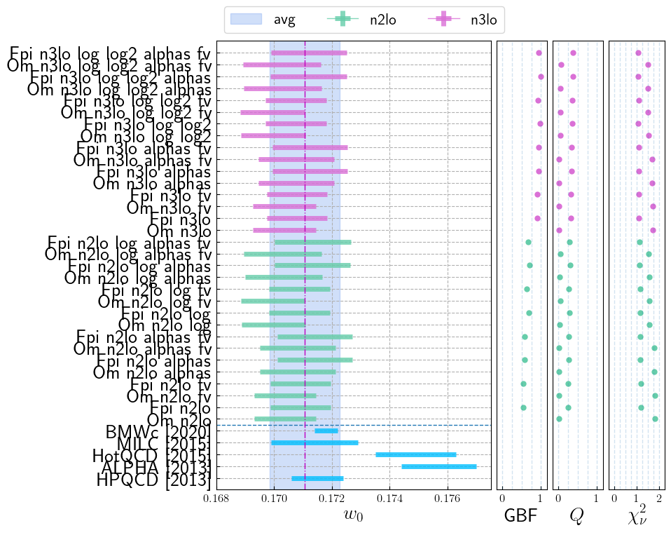
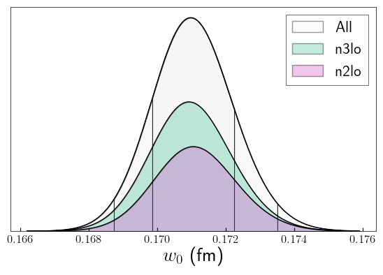
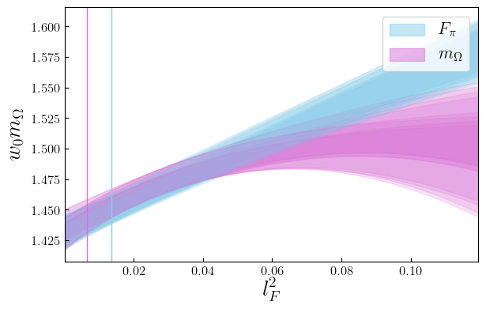

### Highest Weight Models
```yaml
Model: Fpi_n3lo_log_log2_alphas
w0: 0.1712(13)

w0/a06: 2.987(14)     => a06/fm: 0.05732(57)
w0/a09: 1.9446(67)    => a09/fm: 0.08804(81)
w0/a12: 1.4100(32)    => a12/fm: 0.1214(10)
w0/a15: 1.1452(12)    => a15/fm: 0.1495(12)

Parameters:
            wm0      1.077 (69)      [     1.0 (1.0) ]  
            A_l       1.25 (40)      [     1.0 (1.0) ]  
            A_s       1.38 (41)      [     1.0 (1.0) ]  
            A_a      -1.01 (43)      [    -0.5 (1.0) ]  
           A_aa       0.33 (59)      [     0.0 (1.0) ]  
           A_al      -1.14 (82)      [     0.0 (1.0) ]  *
           A_as       0.84 (79)      [     0.0 (1.0) ]  
           A_ll      -0.29 (95)      [     0.0 (1.0) ]  
           A_ls       0.46 (91)      [     0.0 (1.0) ]  
           A_ss      -0.78 (79)      [     0.0 (1.0) ]  
         A_ll_g       0.57 (86)      [     0.0 (1.0) ]  
          A_aaa       0.02 (95)      [     0.0 (1.0) ]  
          A_aal      -0.20 (98)      [     0.0 (1.0) ]  
          A_aas       0.27 (96)      [     0.0 (1.0) ]  
          A_all      -0.2 (1.0)      [     0.0 (1.0) ]  
          A_als      -0.25 (99)      [     0.0 (1.0) ]  
          A_ass       0.44 (92)      [     0.0 (1.0) ]  
          A_lll    -0.03 (1.00)      [     0.0 (1.0) ]  
          A_lls    -0.08 (1.00)      [     0.0 (1.0) ]  
          A_lss       0.25 (98)      [     0.0 (1.0) ]  
          A_sss      -0.82 (88)      [     0.0 (1.0) ]  
        A_lll_g       0.07 (99)      [     0.0 (1.0) ]  
        A_lls_g       0.13 (99)      [     0.0 (1.0) ]  
       A_lll_gg      -0.19 (98)      [     0.0 (1.0) ]  
        A_alpha       0.34 (61)      [     0.00 (70) ]  

Least Square Fit:
  chi2/dof [dof] = 1.1 [22]    Q = 0.37    logGBF = 65.23

Settings:
  svdcut/n = 1e-12/0    tol = (1e-08*,1e-10,1e-10)    (itns/time = 15/0.1)

Error Budget:
  stat      53.4%
  disc      39.1%
  pp_input   5.5%
  chiral     1.9%
```
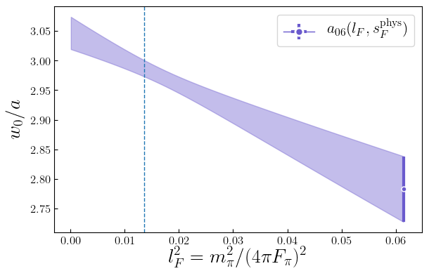
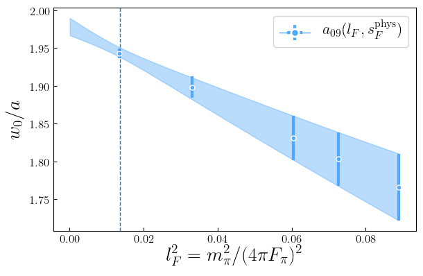
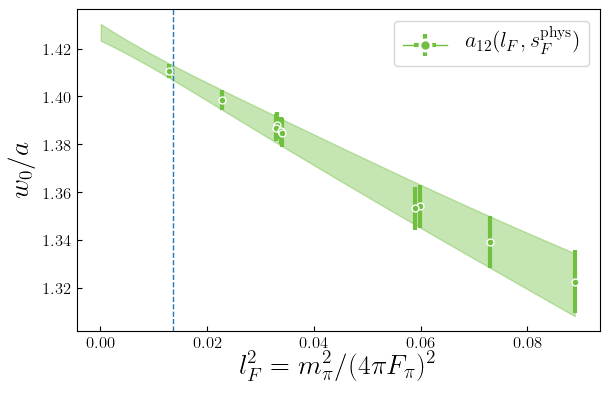
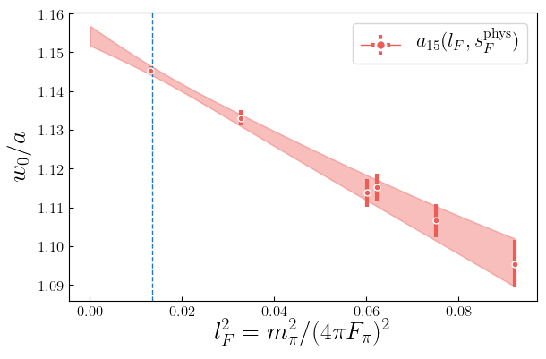
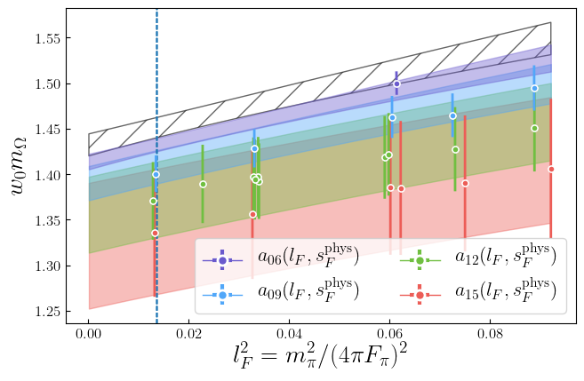

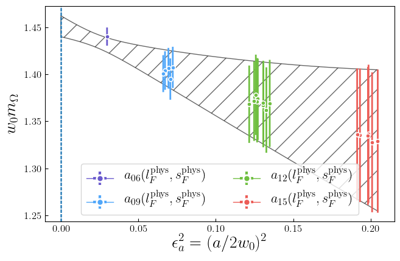

```yaml
Model: Fpi_n3lo_log_log2
w0: 0.1708(11)

w0/a06: 2.987(14)     => a06/fm: 0.05717(51)
w0/a09: 1.9446(67)    => a09/fm: 0.08781(70)
w0/a12: 1.4100(32)    => a12/fm: 0.12111(86)
w0/a15: 1.1452(12)    => a15/fm: 0.14912(97)

Parameters:
            wm0      1.075 (69)      [     1.0 (1.0) ]  
            A_l       1.24 (40)      [     1.0 (1.0) ]  
            A_s       1.38 (41)      [     1.0 (1.0) ]  
            A_a      -0.83 (28)      [    -0.5 (1.0) ]  
           A_aa       0.43 (56)      [     0.0 (1.0) ]  
           A_al      -1.13 (82)      [     0.0 (1.0) ]  *
           A_as       0.88 (79)      [     0.0 (1.0) ]  
           A_ll      -0.30 (95)      [     0.0 (1.0) ]  
           A_ls       0.47 (91)      [     0.0 (1.0) ]  
           A_ss      -0.79 (79)      [     0.0 (1.0) ]  
         A_ll_g       0.58 (86)      [     0.0 (1.0) ]  
          A_aaa       0.04 (95)      [     0.0 (1.0) ]  
          A_aal      -0.20 (98)      [     0.0 (1.0) ]  
          A_aas       0.30 (95)      [     0.0 (1.0) ]  
          A_all      -0.2 (1.0)      [     0.0 (1.0) ]  
          A_als      -0.25 (99)      [     0.0 (1.0) ]  
          A_ass       0.45 (92)      [     0.0 (1.0) ]  
          A_lll    -0.03 (1.00)      [     0.0 (1.0) ]  
          A_lls    -0.08 (1.00)      [     0.0 (1.0) ]  
          A_lss       0.25 (98)      [     0.0 (1.0) ]  
          A_sss      -0.83 (88)      [     0.0 (1.0) ]  
        A_lll_g       0.08 (99)      [     0.0 (1.0) ]  
        A_lls_g       0.13 (99)      [     0.0 (1.0) ]  
       A_lll_gg      -0.19 (98)      [     0.0 (1.0) ]  

Least Square Fit:
  chi2/dof [dof] = 1.1 [22]    Q = 0.36    logGBF = 65.205

Settings:
  svdcut/n = 1e-12/0    tol = (1e-08*,1e-10,1e-10)    (itns/time = 16/0.1)

Error Budget:
  stat      74.2%
  disc      15.4%
  pp_input   8.2%
  chiral     2.1%
```
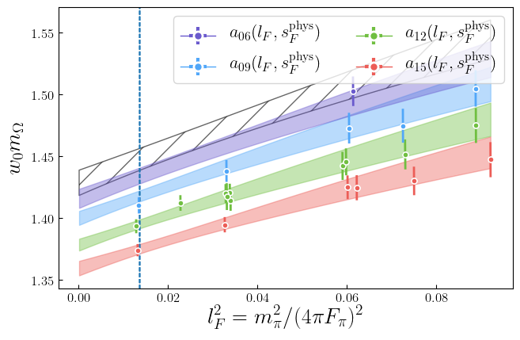
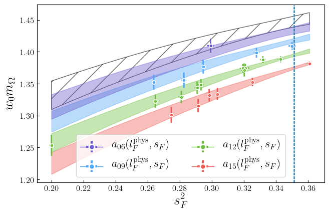
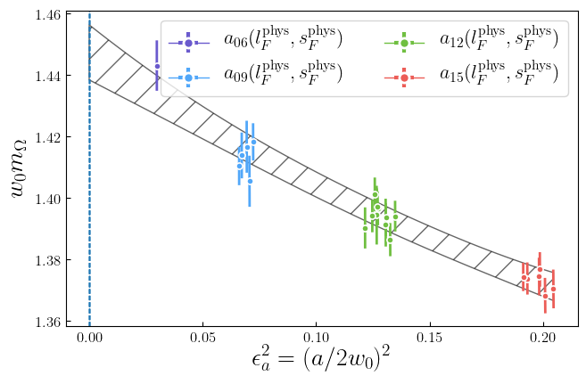

```yaml
Model: Fpi_n3lo_log_log2_alphas_fv
w0: 0.1712(13)

w0/a06: 2.987(14)     => a06/fm: 0.05732(57)
w0/a09: 1.9446(67)    => a09/fm: 0.08804(81)
w0/a12: 1.4100(32)    => a12/fm: 0.1214(10)
w0/a15: 1.1452(12)    => a15/fm: 0.1495(12)

Parameters:
            wm0      1.077 (69)      [     1.0 (1.0) ]  
            A_l       1.24 (40)      [     1.0 (1.0) ]  
            A_s       1.39 (41)      [     1.0 (1.0) ]  
            A_a      -1.02 (43)      [    -0.5 (1.0) ]  
           A_aa       0.33 (59)      [     0.0 (1.0) ]  
           A_al      -1.15 (82)      [     0.0 (1.0) ]  *
           A_as       0.85 (79)      [     0.0 (1.0) ]  
           A_ll      -0.30 (95)      [     0.0 (1.0) ]  
           A_ls       0.45 (91)      [     0.0 (1.0) ]  
           A_ss      -0.79 (79)      [     0.0 (1.0) ]  
         A_ll_g       0.51 (85)      [     0.0 (1.0) ]  
          A_aaa       0.02 (95)      [     0.0 (1.0) ]  
          A_aal      -0.21 (98)      [     0.0 (1.0) ]  
          A_aas       0.27 (96)      [     0.0 (1.0) ]  
          A_all      -0.2 (1.0)      [     0.0 (1.0) ]  
          A_als      -0.26 (99)      [     0.0 (1.0) ]  
          A_ass       0.44 (92)      [     0.0 (1.0) ]  
          A_lll    -0.03 (1.00)      [     0.0 (1.0) ]  
          A_lls    -0.08 (1.00)      [     0.0 (1.0) ]  
          A_lss       0.25 (98)      [     0.0 (1.0) ]  
          A_sss      -0.83 (88)      [     0.0 (1.0) ]  
        A_lll_g       0.07 (99)      [     0.0 (1.0) ]  
        A_lls_g       0.11 (99)      [     0.0 (1.0) ]  
       A_lll_gg      -0.16 (98)      [     0.0 (1.0) ]  
        A_alpha       0.34 (61)      [     0.00 (70) ]  

Least Square Fit:
  chi2/dof [dof] = 1.1 [22]    Q = 0.37    logGBF = 65.168

Settings:
  svdcut/n = 1e-12/0    tol = (1e-08*,1e-10,1e-10)    (itns/time = 15/0.2)

Error Budget:
  stat      53.5%
  disc      39.2%
  pp_input   5.4%
  chiral     1.9%
```
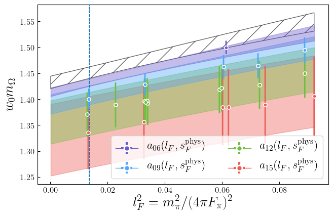
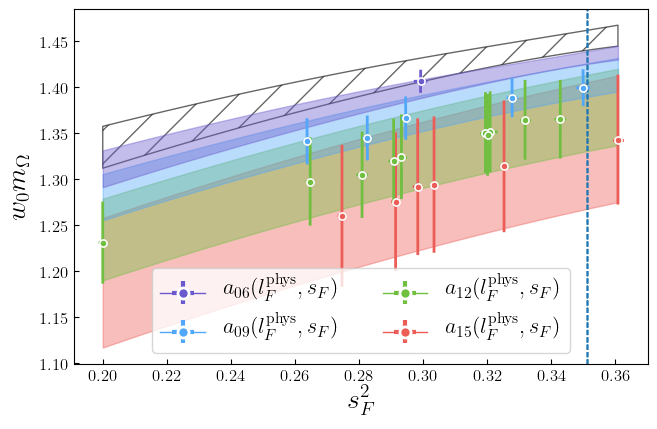
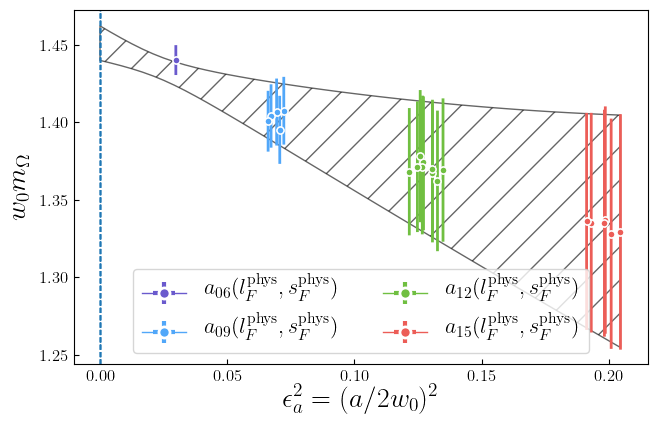

```yaml
Model: Fpi_n3lo_alphas
w0: 0.1712(13)

w0/a06: 2.987(14)     => a06/fm: 0.05733(57)
w0/a09: 1.9446(67)    => a09/fm: 0.08806(80)
w0/a12: 1.4100(32)    => a12/fm: 0.1215(10)
w0/a15: 1.1452(12)    => a15/fm: 0.1495(12)

Parameters:
            wm0      1.072 (69)      [     1.0 (1.0) ]  
            A_l       1.07 (31)      [     1.0 (1.0) ]  
            A_s       1.45 (40)      [     1.0 (1.0) ]  
            A_a      -1.03 (43)      [    -0.5 (1.0) ]  
           A_aa       0.36 (59)      [     0.0 (1.0) ]  
           A_al      -1.18 (82)      [     0.0 (1.0) ]  *
           A_as       0.85 (79)      [     0.0 (1.0) ]  
           A_ll      -0.45 (92)      [     0.0 (1.0) ]  
           A_ls       0.54 (90)      [     0.0 (1.0) ]  
           A_ss      -0.88 (78)      [     0.0 (1.0) ]  
          A_aaa       0.02 (95)      [     0.0 (1.0) ]  
          A_aal      -0.21 (98)      [     0.0 (1.0) ]  
          A_aas       0.28 (96)      [     0.0 (1.0) ]  
          A_all      -0.2 (1.0)      [     0.0 (1.0) ]  
          A_als      -0.25 (99)      [     0.0 (1.0) ]  
          A_ass       0.43 (92)      [     0.0 (1.0) ]  
          A_lll    -0.05 (1.00)      [     0.0 (1.0) ]  
          A_lls      -0.1 (1.0)      [     0.0 (1.0) ]  
          A_lss       0.31 (98)      [     0.0 (1.0) ]  
          A_sss      -0.94 (86)      [     0.0 (1.0) ]  
        A_alpha       0.35 (61)      [     0.00 (70) ]  

Least Square Fit:
  chi2/dof [dof] = 1.1 [22]    Q = 0.34    logGBF = 65.163

Settings:
  svdcut/n = 1e-12/0    tol = (1e-08*,1e-10,1e-10)    (itns/time = 14/0.1)

Error Budget:
  stat      53.7%
  disc      39.4%
  pp_input   4.7%
  chiral     2.1%
```
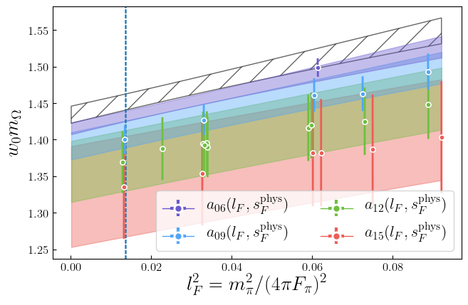

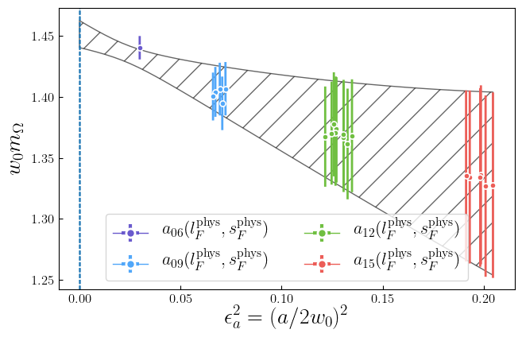

```yaml
Model: Fpi_n3lo_alphas_fv
w0: 0.1712(13)

w0/a06: 2.987(14)     => a06/fm: 0.05733(57)
w0/a09: 1.9446(67)    => a09/fm: 0.08806(80)
w0/a12: 1.4100(32)    => a12/fm: 0.1215(10)
w0/a15: 1.1452(12)    => a15/fm: 0.1495(12)

Parameters:
            wm0      1.072 (69)      [     1.0 (1.0) ]  
            A_l       1.07 (31)      [     1.0 (1.0) ]  
            A_s       1.45 (40)      [     1.0 (1.0) ]  
            A_a      -1.03 (43)      [    -0.5 (1.0) ]  
           A_aa       0.36 (59)      [     0.0 (1.0) ]  
           A_al      -1.18 (82)      [     0.0 (1.0) ]  *
           A_as       0.85 (79)      [     0.0 (1.0) ]  
           A_ll      -0.45 (92)      [     0.0 (1.0) ]  
           A_ls       0.54 (90)      [     0.0 (1.0) ]  
           A_ss      -0.88 (78)      [     0.0 (1.0) ]  
          A_aaa       0.02 (95)      [     0.0 (1.0) ]  
          A_aal      -0.21 (98)      [     0.0 (1.0) ]  
          A_aas       0.28 (96)      [     0.0 (1.0) ]  
          A_all      -0.2 (1.0)      [     0.0 (1.0) ]  
          A_als      -0.25 (99)      [     0.0 (1.0) ]  
          A_ass       0.43 (92)      [     0.0 (1.0) ]  
          A_lll    -0.05 (1.00)      [     0.0 (1.0) ]  
          A_lls      -0.1 (1.0)      [     0.0 (1.0) ]  
          A_lss       0.31 (98)      [     0.0 (1.0) ]  
          A_sss      -0.94 (86)      [     0.0 (1.0) ]  
        A_alpha       0.35 (61)      [     0.00 (70) ]  

Least Square Fit:
  chi2/dof [dof] = 1.1 [22]    Q = 0.34    logGBF = 65.163

Settings:
  svdcut/n = 1e-12/0    tol = (1e-08*,1e-10,1e-10)    (itns/time = 14/0.1)

Error Budget:
  stat      53.7%
  disc      39.4%
  pp_input   4.7%
  chiral     2.1%
```


