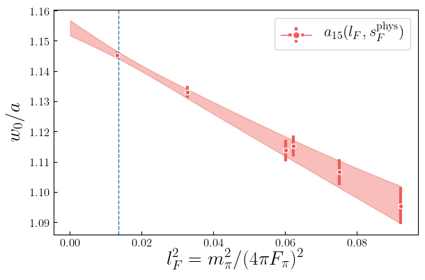
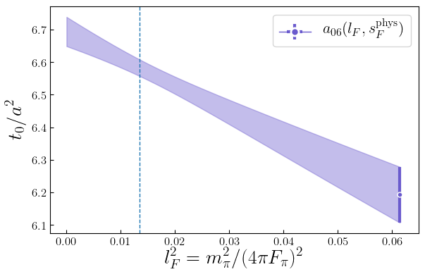
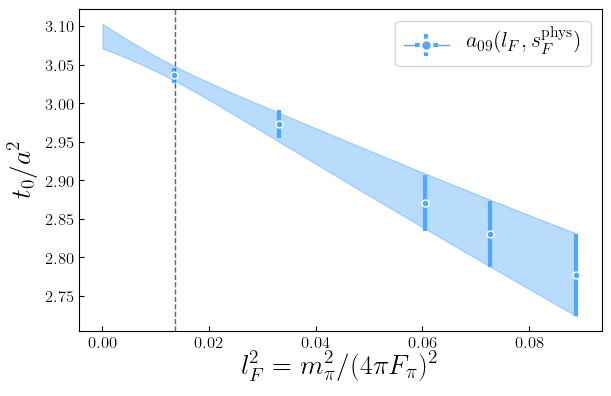
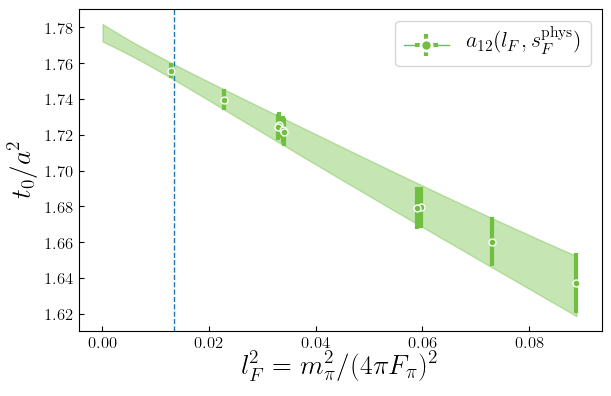
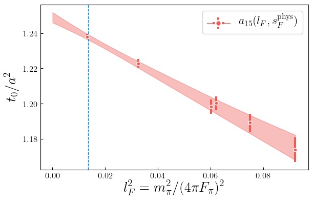

## Autogenerated
### Priors
observable: t0 
| model | c0 | A_a | A_l | A_s | A_aa | A_al | A_as | A_ll | A_ll_g | A_ls | A_ss | A_aaa | A_aal | A_aas | A_all | A_als | A_ass | A_lll | A_lll_g | A_lll_gg | A_lls | A_lls_g | A_lss | A_sss | A_alpha |
| --- | --- | --- | --- | --- | --- | --- | --- | --- | --- | --- | --- | --- | --- | --- | --- | --- | --- | --- | --- | --- | --- | --- | --- | --- | --- |
| default_Fpi | 1.0(1.0) | 0.5(1.0) | 1.0(1.0) | 1.0(1.0) | 0.0(2.0) | 0.0(2.0) | 0.0(2.0) | 0.0(1.0) | 0.0(1.0) | 0.0(1.0) | 0.0(1.0) | 0.0(1.0) | 0.0(1.0) | 0.0(1.0) | 0.0(1.0) | 0.0(1.0) | 0.0(1.0) | 0.0(1.0) | 0.0(1.0) | 0.0(1.0) | 0.0(1.0) | 0.0(1.0) | 0.0(1.0) | 0.0(1.0) | 0.00(70) |
| default_Om | 1.0(1.0) | 0.5(1.0) | 2.0(2.0) | 2.0(2.0) | 0.0(2.0) | 0.0(2.0) | 0.0(2.0) | 0.0(4.0) | 0.0(4.0) | 0.0(4.0) | 0.0(4.0) | 0.0(1.0) | 0.0(2.0) | 0.0(2.0) | 0.0(4.0) | 0.0(4.0) | 0.0(4.0) | 0.0(8.0) | 0.0(8.0) | 0.0(8.0) | 0.0(8.0) | 0.0(8.0) | 0.0(8.0) | 0.0(8.0) | 0.00(70) |


observable: w0 
| model | c0 | A_a | A_l | A_s | A_aa | A_al | A_as | A_ll | A_ll_g | A_ls | A_ss | A_aaa | A_aal | A_aas | A_all | A_als | A_ass | A_lll | A_lll_g | A_lll_gg | A_lls | A_lls_g | A_lss | A_sss | A_alpha |
| --- | --- | --- | --- | --- | --- | --- | --- | --- | --- | --- | --- | --- | --- | --- | --- | --- | --- | --- | --- | --- | --- | --- | --- | --- | --- |
| default_Fpi | 1.0(1.0) | -0.5(1.0) | 1.0(1.0) | 1.0(1.0) | 0.0(1.0) | 0.0(1.0) | 0.0(1.0) | 0.0(1.0) | 0.0(1.0) | 0.0(1.0) | 0.0(1.0) | 0.0(1.0) | 0.0(1.0) | 0.0(1.0) | 0.0(1.0) | 0.0(1.0) | 0.0(1.0) | 0.0(1.0) | 0.0(1.0) | 0.0(1.0) | 0.0(1.0) | 0.0(1.0) | 0.0(1.0) | 0.0(1.0) | 0.00(70) |
| default_Om | 1.0(1.0) | -0.5(1.0) | 2.0(2.0) | 2.0(2.0) | 0.0(1.0) | 0.0(2.0) | 0.0(2.0) | 0.0(4.0) | 0.0(4.0) | 0.0(4.0) | 0.0(4.0) | 0.0(1.0) | 0.0(2.0) | 0.0(2.0) | 0.0(4.0) | 0.0(4.0) | 0.0(4.0) | 0.0(8.0) | 0.0(8.0) | 0.0(8.0) | 0.0(8.0) | 0.0(8.0) | 0.0(8.0) | 0.0(8.0) | 0.00(70) |


| model | c0a06 | c0a09 | c0a12 | c0a15 | k_a | k_l | k_s | k_aa | k_al | k_as | k_ll | k_ll_g | k_ls | k_ss |
| --- | --- | --- | --- | --- | --- | --- | --- | --- | --- | --- | --- | --- | --- | --- |
| t0_interpolation | 6.0(1.0) | 3.0(1.0) | 1.5(1.0) | 1.0(1.0) | 2.0(2.0) | 0.0(2.0) | 0.0(2.0) | 0.0(2.0) | 0.0(2.0) | 0.0(2.0) | 0.0(2.0) | 0.0(2.0) | 0.0(2.0) | 0.0(2.0) |


| model | c0a06 | c0a09 | c0a12 | c0a15 | k_a | k_l | k_s | k_aa | k_al | k_as | k_ll | k_ll_g | k_ls | k_ss |
| --- | --- | --- | --- | --- | --- | --- | --- | --- | --- | --- | --- | --- | --- | --- |
| w0_interpolation | 3.0(1.0) | 2.0(1.0) | 1.5(1.0) | 1.0(1.0) | 2.0(2.0) | 0.0(2.0) | 0.0(2.0) | 0.0(2.0) | 0.0(2.0) | 0.0(2.0) | 0.0(2.0) | 0.0(2.0) | 0.0(2.0) | 0.0(2.0) |


### Inputs
| ens | Fpi | L | a/w | alpha_s | mO | mk | mpi | t/a^2 |
| --- | --- | --- | --- | --- | --- | --- | --- | --- |
| a06m310L | 0.030366(83) | 72.000000(72) | 0.34533(24) | 0.29985000(30) | 0.5069(21) | 0.162049(73) | 0.094560(58) | 6.4079(45) |
| a09m135 | 0.04079(10) | 64.000000(64) | 0.51414(26) | 0.43356000(43) | 0.7244(25) | 0.218500(78) | 0.059459(63) | 3.0390(12) |
| a09m220 | 0.042843(79) | 48.000000(48) | 0.51862(32) | 0.43356000(43) | 0.7377(30) | 0.228702(91) | 0.097900(63) | 3.0172(16) |
| a09m310 | 0.045523(68) | 32.000000(32) | 0.52701(53) | 0.43356000(43) | 0.7543(36) | 0.24106(14) | 0.14072(12) | 2.9689(32) |
| a09m350 | 0.046632(84) | 32.000000(32) | 0.53160(76) | 0.43356000(43) | 0.7561(35) | 0.24696(12) | 0.15785(20) | 2.9455(37) |
| a09m400 | 0.048368(75) | 32.000000(32) | 0.53761(61) | 0.43356000(43) | 0.7716(23) | 0.25523(13) | 0.18116(15) | 2.9158(42) |
| a12m130 | 0.05701(11) | 48.000000(48) | 0.70646(25) | 0.53796000(54) | 0.9801(26) | 0.30215(11) | 0.08126(16) | 1.76281(66) |
| a12m180L | 0.05781(11) | 48.000000(48) | 0.70958(22) | 0.53796000(54) | 0.9924(26) | 0.305937(89) | 0.109624(59) | 1.7552(13) |
| a12m220 | 0.05870(13) | 32.000000(32) | 0.71190(51) | 0.53796000(54) | 0.9924(60) | 0.31001(17) | 0.13428(17) | 1.7498(14) |
| a12m220L | 0.05881(13) | 40.000000(40) | 0.71220(32) | 0.53796000(54) | 0.9944(30) | 0.31021(19) | 0.13402(15) | 1.74893(86) |
| a12m220S | 0.05865(16) | 24.000000(24) | 0.71322(76) | 0.53796000(54) | 0.9970(26) | 0.31043(22) | 0.13557(32) | 1.7466(20) |
| a12m220ms | 0.05732(11) | 32.000000(32) | 0.69740(58) | 0.53796000(54) | 0.8896(92) | 0.24639(13) | 0.13282(13) | 1.7891(15) |
| a12m310 | 0.06138(11) | 24.000000(24) | 0.72307(68) | 0.53796000(54) | 1.0112(32) | 0.32414(21) | 0.18870(17) | 1.7213(19) |
| a12m310XL | 0.06176(12) | 48.000000(48) | 0.72303(28) | 0.53796000(54) | 1.0072(41) | 0.324608(91) | 0.188574(81) | 1.72211(70) |
| a12m350 | 0.06299(14) | 24.000000(24) | 0.72846(53) | 0.53796000(54) | 1.0139(26) | 0.33306(16) | 0.21397(20) | 1.7091(14) |
| a12m400 | 0.06498(11) | 24.000000(24) | 0.73442(46) | 0.53796000(54) | 1.0279(25) | 0.34341(14) | 0.24347(16) | 1.6942(11) |
| a15m135XL | 0.07131(11) | 48.000000(48) | 0.87473(23) | 0.58801000(59) | 1.2081(19) | 0.38755(14) | 0.102929(69) | 1.23502(31) |
| a15m220 | 0.072768(84) | 24.000000(24) | 0.87890(53) | 0.58801000(59) | 1.2068(26) | 0.38690(21) | 0.16533(19) | 1.22978(84) |
| a15m310 | 0.075290(89) | 16.000000(16) | 0.89058(76) | 0.58801000(59) | 1.2312(36) | 0.40457(25) | 0.23601(29) | 1.21214(89) |
| a15m310L | 0.07594(14) | 24.000000(24) | 0.89138(56) | 0.58801000(59) | 1.2287(31) | 0.40408(22) | 0.23411(21) | 1.21106(69) |
| a15m350 | 0.07690(11) | 16.000000(16) | 0.89654(88) | 0.58801000(59) | 1.2331(31) | 0.41369(28) | 0.26473(30) | 1.2032(14) |
| a15m400 | 0.07938(12) | 16.000000(16) | 0.90465(98) | 0.58801000(59) | 1.2437(43) | 0.42723(27) | 0.30281(31) | 1.1905(15) |

### Model Average
```yaml
sqrt_t0: 0.1428(12)

---
Uncertainty: 
   RMS model sdev:   0.00114 
   Model unc:        0.00014 

---
Error budget (RMS model sdev): 
   Statistical:  0.00094 
   Chiral:       0.00018 
   Disc:         0.00050 
   Phys point:   0.00027 

---
Highest Weight: 
   0.091:  Fpi_n3lo
   0.091:  Fpi_n3lo_fv
   0.084:  Fpi_n3lo_alphas_fv
   0.084:  Fpi_n3lo_alphas
   0.080:  Fpi_n3lo_log_log2

------
w0: 0.1711(12)

---
Uncertainty: 
   RMS model sdev:   0.00119 
   Model unc:        0.00024 

---
Error budget (RMS model sdev): 
   Statistical:  0.00093 
   Chiral:       0.00017 
   Disc:         0.00061 
   Phys point:   0.00031 

---
Highest Weight: 
   0.080:  Fpi_n3lo_log_log2_alphas
   0.078:  Fpi_n3lo_log_log2
   0.076:  Fpi_n3lo_log_log2_alphas_fv
   0.075:  Fpi_n3lo_alphas_fv
   0.075:  Fpi_n3lo_alphas

------
```


## Representative model
```yaml
Model: Fpi_n3lo_log_log2_fv
---

w0: 0.1708(11)

w0/a06: 2.987(14)     => a06/fm: 0.05717(51)
w0/a09: 1.9446(67)    => a09/fm: 0.08781(70)
w0/a12: 1.4100(32)    => a12/fm: 0.12111(86)
w0/a15: 1.1452(12)    => a15/fm: 0.14912(97)

Parameters:
             c0      1.076 (69)      [     1.0 (1.0) ]  
            A_l       1.23 (40)      [     1.0 (1.0) ]  
            A_s       1.39 (41)      [     1.0 (1.0) ]  
            A_a      -0.83 (28)      [    -0.5 (1.0) ]  
           A_aa       0.44 (56)      [     0.0 (1.0) ]  
           A_al      -1.14 (82)      [     0.0 (1.0) ]  *
           A_as       0.88 (79)      [     0.0 (1.0) ]  
           A_ll      -0.31 (95)      [     0.0 (1.0) ]  
           A_ls       0.46 (91)      [     0.0 (1.0) ]  
           A_ss      -0.80 (79)      [     0.0 (1.0) ]  
         A_ll_g       0.52 (85)      [     0.0 (1.0) ]  
          A_aaa       0.04 (95)      [     0.0 (1.0) ]  
          A_aal      -0.20 (98)      [     0.0 (1.0) ]  
          A_aas       0.30 (95)      [     0.0 (1.0) ]  
          A_all      -0.2 (1.0)      [     0.0 (1.0) ]  
          A_als      -0.25 (99)      [     0.0 (1.0) ]  
          A_ass       0.45 (92)      [     0.0 (1.0) ]  
          A_lll    -0.03 (1.00)      [     0.0 (1.0) ]  
          A_lls    -0.08 (1.00)      [     0.0 (1.0) ]  
          A_lss       0.25 (98)      [     0.0 (1.0) ]  
          A_sss      -0.84 (88)      [     0.0 (1.0) ]  
        A_lll_g       0.07 (99)      [     0.0 (1.0) ]  
        A_lls_g       0.11 (99)      [     0.0 (1.0) ]  
       A_lll_gg      -0.16 (98)      [     0.0 (1.0) ]  

Least Square Fit:
  chi2/dof [dof] = 1.1 [22]    Q = 0.35    logGBF = 65.142

Settings:
  svdcut/n = 1e-12/0    tol = (1e-08*,1e-10,1e-10)    (itns/time = 14/0.2)

Error Budget:
  stat      74.4%
  disc      15.4%
  pp_input   8.1%
  chiral     2.1%

---

sqrt(t0): 0.1427(10)

t0/a06^2: 6.583(27)   => a06/fm: 0.05561(44)
t0/a09^2: 3.0387(99)  => a09/fm: 0.08185(63)
t0/a12^2: 1.7550(45)  => a12/fm: 0.10770(81)
t0/a15^2: 1.2378(16)  => a15/fm: 0.12824(93)

Parameters:
             c0         0.845 (76)        [     1.0 (1.0) ]  
            A_l          1.46 (42)        [     1.0 (1.0) ]  
            A_s          1.41 (41)        [     1.0 (1.0) ]  
            A_a          0.49 (44)        [     0.5 (1.0) ]  
           A_aa         -1.75 (62)        [     0.0 (2.0) ]  
           A_al         -2.0 (1.3)        [     0.0 (2.0) ]  *
           A_as          1.6 (1.3)        [     0.0 (2.0) ]  
           A_ll         -0.13 (95)        [     0.0 (1.0) ]  
           A_ls          0.41 (91)        [     0.0 (1.0) ]  
           A_ss         -0.91 (79)        [     0.0 (1.0) ]  
         A_ll_g          0.26 (85)        [     0.0 (1.0) ]  
          A_aaa         -0.24 (98)        [     0.0 (1.0) ]  
          A_aal         -0.07 (99)        [     0.0 (1.0) ]  
          A_aas         -0.15 (98)        [     0.0 (1.0) ]  
          A_all       -0.09 (1.00)        [     0.0 (1.0) ]  
          A_als         -0.08 (99)        [     0.0 (1.0) ]  
          A_ass          0.07 (97)        [     0.0 (1.0) ]  
          A_lll   -0.0009 (0.9986)        [     0.0 (1.0) ]  
          A_lls       -0.04 (1.00)        [     0.0 (1.0) ]  
          A_lss          0.20 (98)        [     0.0 (1.0) ]  
          A_sss         -0.95 (87)        [     0.0 (1.0) ]  
        A_lll_g          0.02 (99)        [     0.0 (1.0) ]  
        A_lls_g          0.07 (99)        [     0.0 (1.0) ]  
       A_lll_gg         -0.06 (98)        [     0.0 (1.0) ]  

Least Square Fit:
  chi2/dof [dof] = 1 [22]    Q = 0.46    logGBF = 65.922

Settings:
  svdcut/n = 1e-12/0    tol = (1e-08*,1e-10,1e-10)    (itns/time = 14/0.2)

Error Budget:
  stat      77.4%
  disc       7.3%
  pp_input   5.8%
  chiral     2.3%
```

### w0 interpolation




### t0 interpolation





### Lattice dependence


### Light quark mass dependence


### Strange quark mass dependence


