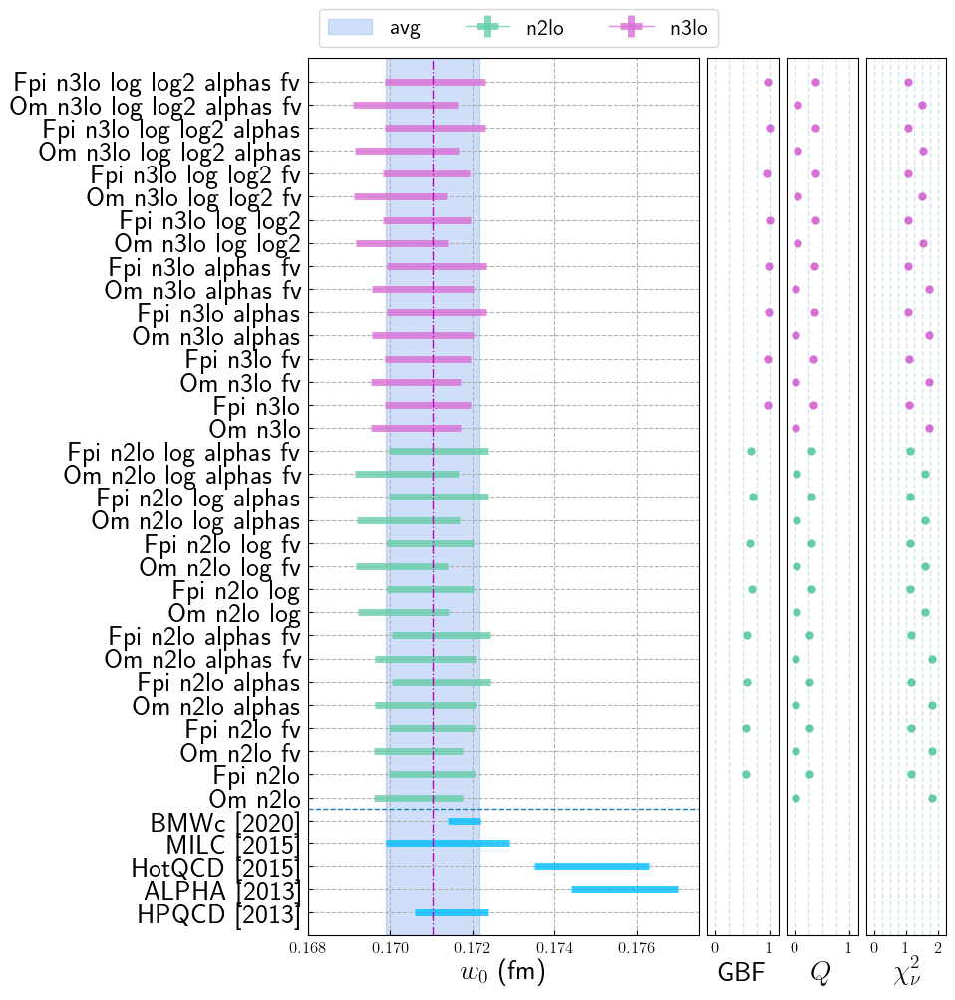

## Autogenerated
### Priors
observable: t0 
| model | c0 | A_a | A_l | A_s | A_aa | A_al | A_as | A_ll | A_ll_g | A_ls | A_ss | A_aaa | A_aal | A_aas | A_all | A_als | A_ass | A_lll | A_lll_g | A_lll_gg | A_lls | A_lls_g | A_lss | A_sss | A_alpha |
| --- | --- | --- | --- | --- | --- | --- | --- | --- | --- | --- | --- | --- | --- | --- | --- | --- | --- | --- | --- | --- | --- | --- | --- | --- | --- |
| default_Fpi | 1.0(1.0) | 0.0(1.4) | 1.0(1.0) | 1.0(1.0) | 0.0(1.4) | 0.0(1.4) | 0.0(1.4) | 0.0(1.0) | 0.0(1.0) | 0.0(1.0) | 0.0(1.0) | 0.0(1.0) | 0.0(1.0) | 0.0(1.0) | 0.0(1.0) | 0.0(1.0) | 0.0(1.0) | 0.0(1.0) | 0.0(1.0) | 0.0(1.0) | 0.0(1.0) | 0.0(1.0) | 0.0(1.0) | 0.0(1.0) | 0.00(50) |
| default_Om | 1.0(1.0) | 0.0(1.4) | 2.0(2.0) | 2.0(2.0) | 0.0(1.4) | 0.0(2.8) | 0.0(2.8) | 0.0(4.0) | 0.0(4.0) | 0.0(4.0) | 0.0(4.0) | 0.0(1.0) | 0.0(2.0) | 0.0(2.0) | 0.0(4.0) | 0.0(4.0) | 0.0(4.0) | 0.0(8.0) | 0.0(8.0) | 0.0(8.0) | 0.0(8.0) | 0.0(8.0) | 0.0(8.0) | 0.0(8.0) | 0.00(50) |


observable: w0 
| model | c0 | A_a | A_l | A_s | A_aa | A_al | A_as | A_ll | A_ll_g | A_ls | A_ss | A_aaa | A_aal | A_aas | A_all | A_als | A_ass | A_lll | A_lll_g | A_lll_gg | A_lls | A_lls_g | A_lss | A_sss | A_alpha |
| --- | --- | --- | --- | --- | --- | --- | --- | --- | --- | --- | --- | --- | --- | --- | --- | --- | --- | --- | --- | --- | --- | --- | --- | --- | --- |
| default_Fpi | 1.0(1.0) | 0.0(1.4) | 1.0(1.0) | 1.0(1.0) | 0.0(1.4) | 0.0(1.4) | 0.0(1.4) | 0.0(1.0) | 0.0(1.0) | 0.0(1.0) | 0.0(1.0) | 0.0(1.0) | 0.0(1.0) | 0.0(1.0) | 0.0(1.0) | 0.0(1.0) | 0.0(1.0) | 0.0(1.0) | 0.0(1.0) | 0.0(1.0) | 0.0(1.0) | 0.0(1.0) | 0.0(1.0) | 0.0(1.0) | 0.00(50) |
| default_Om | 1.0(1.0) | 0.0(1.4) | 2.0(2.0) | 2.0(2.0) | 0.0(1.4) | 0.0(2.8) | 0.0(2.8) | 0.0(4.0) | 0.0(4.0) | 0.0(4.0) | 0.0(4.0) | 0.0(1.0) | 0.0(2.0) | 0.0(2.0) | 0.0(4.0) | 0.0(4.0) | 0.0(4.0) | 0.0(8.0) | 0.0(8.0) | 0.0(8.0) | 0.0(8.0) | 0.0(8.0) | 0.0(8.0) | 0.0(8.0) | 0.00(50) |


| model | c0a06 | c0a09 | c0a12 | c0a15 | k_a | k_l | k_s | k_aa | k_al | k_as | k_ll | k_ll_g | k_ls | k_ss |
| --- | --- | --- | --- | --- | --- | --- | --- | --- | --- | --- | --- | --- | --- | --- |
| t0_interpolation | 6.0(1.0) | 3.0(1.0) | 1.5(1.0) | 1.0(1.0) | 2.0(2.0) | 0.0(2.0) | 0.0(2.0) | 0.0(2.0) | 0.0(2.0) | 0.0(2.0) | 0.0(2.0) | 0.0(2.0) | 0.0(2.0) | 0.0(2.0) |


| model | c0a06 | c0a09 | c0a12 | c0a15 | k_a | k_l | k_s | k_aa | k_al | k_as | k_ll | k_ll_g | k_ls | k_ss |
| --- | --- | --- | --- | --- | --- | --- | --- | --- | --- | --- | --- | --- | --- | --- |
| w0_interpolation | 3.0(1.0) | 2.0(1.0) | 1.5(1.0) | 1.0(1.0) | 2.0(2.0) | 0.0(2.0) | 0.0(2.0) | 0.0(2.0) | 0.0(2.0) | 0.0(2.0) | 0.0(2.0) | 0.0(2.0) | 0.0(2.0) | 0.0(2.0) |


### Inputs
| ens | Fpi | L | a/w | alpha_s | mO | mk | mpi | t/a^2 |
| --- | --- | --- | --- | --- | --- | --- | --- | --- |
| a06m310L | 0.030366(83) | 72.000000(72) | 0.34420(24) | 0.29985000(30) | 0.5069(21) | 0.162049(73) | 0.094560(58) | 6.0606(44) |
| a09m135 | 0.04079(10) | 64.000000(64) | 0.51118(27) | 0.43356000(43) | 0.7244(25) | 0.218500(78) | 0.059459(63) | 2.7147(11) |
| a09m220 | 0.042843(79) | 48.000000(48) | 0.51577(32) | 0.43356000(43) | 0.7377(30) | 0.228702(91) | 0.097900(63) | 2.6952(15) |
| a09m310 | 0.045523(68) | 32.000000(32) | 0.52449(62) | 0.43356000(43) | 0.7543(36) | 0.24106(14) | 0.14072(12) | 2.6521(29) |
| a09m350 | 0.046632(84) | 32.000000(32) | 0.52909(72) | 0.43356000(43) | 0.7561(35) | 0.24696(12) | 0.15785(20) | 2.6301(34) |
| a09m400 | 0.048368(75) | 32.000000(32) | 0.53517(76) | 0.43356000(43) | 0.7716(23) | 0.25523(13) | 0.18116(15) | 2.6040(33) |
| a12m130 | 0.05701(11) | 48.000000(48) | 0.70366(27) | 0.53796000(54) | 0.9801(26) | 0.30215(11) | 0.08126(16) | 1.47486(56) |
| a12m180L | 0.05781(11) | 48.000000(48) | 0.70697(23) | 0.53796000(54) | 0.9924(26) | 0.305937(89) | 0.109624(59) | 1.46859(45) |
| a12m220 | 0.05870(13) | 32.000000(32) | 0.70942(54) | 0.53796000(54) | 0.9924(60) | 0.31001(17) | 0.13428(17) | 1.4641(12) |
| a12m220L | 0.05881(13) | 40.000000(40) | 0.70975(34) | 0.53796000(54) | 0.9944(30) | 0.31021(19) | 0.13402(15) | 1.46327(75) |
| a12m220S | 0.05865(16) | 24.000000(24) | 0.71080(80) | 0.53796000(54) | 0.9970(26) | 0.31043(22) | 0.13557(32) | 1.4614(17) |
| a12m220ms | 0.05732(11) | 32.000000(32) | 0.69417(60) | 0.53796000(54) | 0.8896(92) | 0.24639(13) | 0.13282(13) | 1.4977(13) |
| a12m310 | 0.06138(11) | 24.000000(24) | 0.72134(65) | 0.53796000(54) | 1.0112(32) | 0.32414(21) | 0.18870(17) | 1.4398(17) |
| a12m310XL | 0.06176(12) | 48.000000(48) | 0.72124(29) | 0.53796000(54) | 1.0072(41) | 0.324608(91) | 0.188574(81) | 1.44066(59) |
| a12m350 | 0.06299(14) | 24.000000(24) | 0.72703(56) | 0.53796000(54) | 1.0139(26) | 0.33306(16) | 0.21397(20) | 1.4298(12) |
| a12m400 | 0.06498(11) | 24.000000(24) | 0.73337(43) | 0.53796000(54) | 1.0279(25) | 0.34341(14) | 0.24347(16) | 1.41722(95) |
| a15m135XL | 0.07131(11) | 48.000000(48) | 0.88350(28) | 0.58801000(59) | 1.2081(19) | 0.38755(14) | 0.102929(69) | 0.98972(26) |
| a15m220 | 0.072768(84) | 24.000000(24) | 0.88853(63) | 0.58801000(59) | 1.2068(26) | 0.38690(21) | 0.16533(19) | 0.98608(66) |
| a15m310 | 0.075290(89) | 16.000000(16) | 0.90261(72) | 0.58801000(59) | 1.2312(36) | 0.40457(25) | 0.23601(29) | 0.97271(68) |
| a15m310L | 0.07594(14) | 24.000000(24) | 0.90369(55) | 0.58801000(59) | 1.2287(31) | 0.40408(22) | 0.23411(21) | 0.97198(53) |
| a15m350 | 0.07690(11) | 16.000000(16) | 0.9101(11) | 0.58801000(59) | 1.2331(31) | 0.41369(28) | 0.26473(30) | 0.9660(11) |
| a15m400 | 0.07938(12) | 16.000000(16) | 0.9202(12) | 0.58801000(59) | 1.2437(43) | 0.42723(27) | 0.30281(31) | 0.9563(11) |

### Model Average
```yaml
sqrt_t0: 0.1423(10)

---
Uncertainty: 
   RMS model sdev:   0.00101 
   Model unc:        0.00010 

---
Error budget (RMS model sdev): 
   Statistical:  0.00083 
   Chiral:       0.00015 
   Disc:         0.00044 
   Phys point:   0.00026 

---
Highest Weight: 
   0.081:  Fpi_n3lo
   0.081:  Fpi_n3lo_fv
   0.079:  Fpi_n3lo_alphas_fv
   0.079:  Fpi_n3lo_alphas
   0.070:  Fpi_n3lo_log_log2

------
w0: 0.1710(11)

---
Uncertainty: 
   RMS model sdev:   0.00114 
   Model unc:        0.00012 

---
Error budget (RMS model sdev): 
   Statistical:  0.00095 
   Chiral:       0.00017 
   Disc:         0.00049 
   Phys point:   0.00030 

---
Highest Weight: 
   0.079:  Fpi_n3lo_log_log2_alphas
   0.078:  Fpi_n3lo_log_log2
   0.077:  Fpi_n3lo_alphas_fv
   0.077:  Fpi_n3lo_alphas
   0.076:  Fpi_n3lo_fv

------
```



## Representative model
```yaml
Model: Fpi_n3lo_log_log2_fv
---

w0: 0.1709(11)

w0/a06: 2.998(15)     => a06/fm: 0.05700(50)
w0/a09: 1.9557(68)    => a09/fm: 0.08738(69)
w0/a12: 1.4155(33)    => a12/fm: 0.12072(86)
w0/a15: 1.1341(14)    => a15/fm: 0.15068(99)

Parameters:
             c0      1.070 (73)      [     1.0 (1.0) ]  
            A_l       1.21 (41)      [     1.0 (1.0) ]  
            A_s       1.44 (41)      [     1.0 (1.0) ]  
            A_a      -0.63 (36)      [     0.0 (1.4) ]  
           A_aa      -0.67 (59)      [     0.0 (1.4) ]  
           A_al      -1.5 (1.1)      [     0.0 (1.4) ]  *
           A_as       0.9 (1.0)      [     0.0 (1.4) ]  
           A_ll      -0.28 (95)      [     0.0 (1.0) ]  
           A_ls       0.44 (91)      [     0.0 (1.0) ]  
           A_ss      -0.86 (79)      [     0.0 (1.0) ]  
         A_ll_g       0.48 (85)      [     0.0 (1.0) ]  
          A_aaa      -0.26 (97)      [     0.0 (1.0) ]  
          A_aal      -0.14 (99)      [     0.0 (1.0) ]  
          A_aas      -0.05 (97)      [     0.0 (1.0) ]  
          A_all      -0.1 (1.0)      [     0.0 (1.0) ]  
          A_als      -0.17 (99)      [     0.0 (1.0) ]  
          A_ass       0.19 (95)      [     0.0 (1.0) ]  
          A_lll    -0.02 (1.00)      [     0.0 (1.0) ]  
          A_lls    -0.07 (1.00)      [     0.0 (1.0) ]  
          A_lss       0.24 (98)      [     0.0 (1.0) ]  
          A_sss      -0.91 (88)      [     0.0 (1.0) ]  
        A_lll_g       0.06 (99)      [     0.0 (1.0) ]  
        A_lls_g       0.10 (99)      [     0.0 (1.0) ]  
       A_lll_gg      -0.14 (98)      [     0.0 (1.0) ]  

Least Square Fit:
  chi2/dof [dof] = 1.1 [22]    Q = 0.37    logGBF = 64.342

Settings:
  svdcut/n = 1e-12/0    tol = (1e-08*,1e-10,1e-10)    (itns/time = 16/0.2)

Error Budget:
  stat      79.9%
  disc      10.5%
  pp_input   7.4%
  chiral     2.2%

---

sqrt(t0): 0.14221(92)

t0/a06^2: 6.228(28)   => a06/fm: 0.05698(42)
t0/a09^2: 2.7143(98)  => a09/fm: 0.08632(62)
t0/a12^2: 1.4679(40)  => a12/fm: 0.11738(81)
t0/a15^2: 0.9920(13)  => a15/fm: 0.14278(95)

Parameters:
             c0      0.853 (68)      [     1.0 (1.0) ]  
            A_l       1.42 (40)      [     1.0 (1.0) ]  
            A_s       1.36 (40)      [     1.0 (1.0) ]  
            A_a      -0.56 (35)      [     0.0 (1.4) ]  
           A_aa       0.29 (56)      [     0.0 (1.4) ]  
           A_al      -1.7 (1.0)      [     0.0 (1.4) ]  *
           A_as       1.3 (1.0)      [     0.0 (1.4) ]  
           A_ll      -0.13 (94)      [     0.0 (1.0) ]  
           A_ls       0.39 (91)      [     0.0 (1.0) ]  
           A_ss      -0.87 (79)      [     0.0 (1.0) ]  
         A_ll_g       0.23 (84)      [     0.0 (1.0) ]  
          A_aaa      -0.02 (96)      [     0.0 (1.0) ]  
          A_aal      -0.12 (99)      [     0.0 (1.0) ]  
          A_aas       0.10 (97)      [     0.0 (1.0) ]  
          A_all      -0.1 (1.0)      [     0.0 (1.0) ]  
          A_als      -0.18 (99)      [     0.0 (1.0) ]  
          A_ass       0.26 (94)      [     0.0 (1.0) ]  
          A_lll   0.002 (0.998)      [     0.0 (1.0) ]  
          A_lls    -0.04 (1.00)      [     0.0 (1.0) ]  
          A_lss       0.20 (98)      [     0.0 (1.0) ]  
          A_sss      -0.91 (87)      [     0.0 (1.0) ]  
        A_lll_g     0.009 (994)      [     0.0 (1.0) ]  
        A_lls_g       0.06 (99)      [     0.0 (1.0) ]  
       A_lll_gg      -0.04 (98)      [     0.0 (1.0) ]  

Least Square Fit:
  chi2/dof [dof] = 1 [22]    Q = 0.41    logGBF = 66.928

Settings:
  svdcut/n = 1e-12/0    tol = (1e-08*,1e-10,1e-10)    (itns/time = 17/0.2)

Error Budget:
  stat      60.7%
  disc       7.8%
  pp_input   5.5%
  chiral     1.6%
```

### w0 interpolation


### t0 interpolation


### Lattice dependence


### Light quark mass dependence


### Strange quark mass dependence


