## Autogenerated
### Priors
observable: t0 
| model | c0 | A_a | A_l | A_s | A_aa | A_al | A_as | A_ll | A_ll_g | A_ls | A_ss | A_aaa | A_aal | A_aas | A_all | A_als | A_ass | A_lll | A_lll_g | A_lll_gg | A_lls | A_lls_g | A_lss | A_sss | A_alpha |
| --- | --- | --- | --- | --- | --- | --- | --- | --- | --- | --- | --- | --- | --- | --- | --- | --- | --- | --- | --- | --- | --- | --- | --- | --- | --- |
| default_Fpi | 1.0(1.0) | 0.0(1.8) | 1.0(1.0) | 1.0(1.0) | 0.0(1.8) | 0.0(1.8) | 0.0(1.8) | 0.0(1.0) | 0.0(1.0) | 0.0(1.0) | 0.0(1.0) | 0.0(1.0) | 0.0(1.0) | 0.0(1.0) | 0.0(1.0) | 0.0(1.0) | 0.0(1.0) | 0.0(1.0) | 0.0(1.0) | 0.0(1.0) | 0.0(1.0) | 0.0(1.0) | 0.0(1.0) | 0.0(1.0) | 0.00(50) |
| default_Om | 1.0(1.0) | 0.0(1.8) | 2.0(2.0) | 2.0(2.0) | 0.0(1.8) | 0.0(3.6) | 0.0(3.6) | 0.0(4.0) | 0.0(4.0) | 0.0(4.0) | 0.0(4.0) | 0.0(1.0) | 0.0(2.0) | 0.0(2.0) | 0.0(4.0) | 0.0(4.0) | 0.0(4.0) | 0.0(8.0) | 0.0(8.0) | 0.0(8.0) | 0.0(8.0) | 0.0(8.0) | 0.0(8.0) | 0.0(8.0) | 0.00(50) |


observable: w0 
| model | c0 | A_a | A_l | A_s | A_aa | A_al | A_as | A_ll | A_ll_g | A_ls | A_ss | A_aaa | A_aal | A_aas | A_all | A_als | A_ass | A_lll | A_lll_g | A_lll_gg | A_lls | A_lls_g | A_lss | A_sss | A_alpha |
| --- | --- | --- | --- | --- | --- | --- | --- | --- | --- | --- | --- | --- | --- | --- | --- | --- | --- | --- | --- | --- | --- | --- | --- | --- | --- |
| default_Fpi | 1.0(1.0) | 0.0(1.2) | 1.0(1.0) | 1.0(1.0) | 0.0(1.2) | 0.0(1.2) | 0.0(1.2) | 0.0(1.0) | 0.0(1.0) | 0.0(1.0) | 0.0(1.0) | 0.0(1.0) | 0.0(1.0) | 0.0(1.0) | 0.0(1.0) | 0.0(1.0) | 0.0(1.0) | 0.0(1.0) | 0.0(1.0) | 0.0(1.0) | 0.0(1.0) | 0.0(1.0) | 0.0(1.0) | 0.0(1.0) | 0.00(50) |
| default_Om | 1.0(1.0) | 0.0(1.2) | 2.0(2.0) | 2.0(2.0) | 0.0(1.2) | 0.0(2.4) | 0.0(2.4) | 0.0(4.0) | 0.0(4.0) | 0.0(4.0) | 0.0(4.0) | 0.0(1.0) | 0.0(2.0) | 0.0(2.0) | 0.0(4.0) | 0.0(4.0) | 0.0(4.0) | 0.0(8.0) | 0.0(8.0) | 0.0(8.0) | 0.0(8.0) | 0.0(8.0) | 0.0(8.0) | 0.0(8.0) | 0.00(50) |


| model | c0a06 | c0a09 | c0a12 | c0a15 | k_a | k_l | k_s | k_aa | k_al | k_as | k_ll | k_ll_g | k_ls | k_ss |
| --- | --- | --- | --- | --- | --- | --- | --- | --- | --- | --- | --- | --- | --- | --- |
| t0_interpolation | 6.0(1.0) | 3.0(1.0) | 1.5(1.0) | 1.0(1.0) | 2.0(2.0) | 0.0(2.0) | 0.0(2.0) | 0.0(2.0) | 0.0(2.0) | 0.0(2.0) | 0.0(2.0) | 0.0(2.0) | 0.0(2.0) | 0.0(2.0) |


| model | c0a06 | c0a09 | c0a12 | c0a15 | k_a | k_l | k_s | k_aa | k_al | k_as | k_ll | k_ll_g | k_ls | k_ss |
| --- | --- | --- | --- | --- | --- | --- | --- | --- | --- | --- | --- | --- | --- | --- |
| w0_interpolation | 3.0(1.0) | 2.0(1.0) | 1.5(1.0) | 1.0(1.0) | 2.0(2.0) | 0.0(2.0) | 0.0(2.0) | 0.0(2.0) | 0.0(2.0) | 0.0(2.0) | 0.0(2.0) | 0.0(2.0) | 0.0(2.0) | 0.0(2.0) |


### Inputs
| ens | Fpi | L | a/w | a/w:impr | a/w:orig | alpha_s | mO | mk | mpi | t/a^2 | t/a^2:impr | t/a^2:orig |
| --- | --- | --- | --- | --- | --- | --- | --- | --- | --- | --- | --- | --- |
| a06m310L | 0.030366(83) | 72.000000(72) | 0.34533(24) | 0.34420(24) | 0.34533(24) | 0.29985000(30) | 0.5069(21) | 0.162049(73) | 0.094560(58) | 6.4079(45) | 6.0606(44) | 6.4079(45) |
| a09m135 | 0.04079(10) | 64.000000(64) | 0.51413(27) | 0.51118(27) | 0.51413(27) | 0.43356000(43) | 0.7244(25) | 0.218500(78) | 0.059459(63) | 3.0390(12) | 2.7147(11) | 3.0390(12) |
| a09m220 | 0.042843(79) | 48.000000(48) | 0.51861(31) | 0.51577(32) | 0.51861(31) | 0.43356000(43) | 0.7377(30) | 0.228702(91) | 0.097900(63) | 3.0172(16) | 2.6952(15) | 3.0172(16) |
| a09m310 | 0.045523(68) | 32.000000(32) | 0.52715(60) | 0.52449(62) | 0.52715(60) | 0.43356000(43) | 0.7543(36) | 0.24106(14) | 0.14072(12) | 2.9698(32) | 2.6521(29) | 2.9698(32) |
| a09m350 | 0.046632(84) | 32.000000(32) | 0.53164(71) | 0.52909(72) | 0.53164(71) | 0.43356000(43) | 0.7561(35) | 0.24696(12) | 0.15785(20) | 2.9455(37) | 2.6301(34) | 2.9455(37) |
| a09m400 | 0.048368(75) | 32.000000(32) | 0.53758(74) | 0.53517(76) | 0.53758(74) | 0.43356000(43) | 0.7716(23) | 0.25523(13) | 0.18116(15) | 2.9158(42) | 2.6040(33) | 2.9158(42) |
| a12m130 | 0.05701(11) | 48.000000(48) | 0.70646(26) | 0.70366(27) | 0.70646(26) | 0.53796000(54) | 0.9801(26) | 0.30215(11) | 0.08126(16) | 1.76281(66) | 1.47486(56) | 1.76281(66) |
| a12m180L | 0.05781(11) | 48.000000(48) | 0.70958(22) | 0.70697(23) | 0.70958(22) | 0.53796000(54) | 0.9924(26) | 0.305937(89) | 0.109624(59) | 1.75530(53) | 1.46859(45) | 1.75530(53) |
| a12m220 | 0.05870(13) | 32.000000(32) | 0.71189(51) | 0.70942(54) | 0.71189(51) | 0.53796000(54) | 0.9924(60) | 0.31001(17) | 0.13428(17) | 1.7498(14) | 1.4641(12) | 1.7498(14) |
| a12m220L | 0.05881(13) | 40.000000(40) | 0.71220(32) | 0.70975(34) | 0.71220(32) | 0.53796000(54) | 0.9944(30) | 0.31021(19) | 0.13402(15) | 1.74893(86) | 1.46327(75) | 1.74893(86) |
| a12m220S | 0.05865(16) | 24.000000(24) | 0.71319(76) | 0.71080(80) | 0.71319(76) | 0.53796000(54) | 0.9970(26) | 0.31043(22) | 0.13557(32) | 1.7466(20) | 1.4614(17) | 1.7466(20) |
| a12m220ms | 0.05732(11) | 32.000000(32) | 0.69739(57) | 0.69417(60) | 0.69739(57) | 0.53796000(54) | 0.8896(92) | 0.24639(13) | 0.13282(13) | 1.7891(15) | 1.4977(13) | 1.7891(15) |
| a12m310 | 0.06138(11) | 24.000000(24) | 0.72307(66) | 0.72134(65) | 0.72307(66) | 0.53796000(54) | 1.0112(32) | 0.32414(21) | 0.18870(17) | 1.7213(19) | 1.4398(17) | 1.7213(19) |
| a12m310XL | 0.06176(12) | 48.000000(48) | 0.72303(27) | 0.72124(29) | 0.72303(27) | 0.53796000(54) | 1.0072(41) | 0.324608(91) | 0.188574(81) | 1.72211(70) | 1.44066(59) | 1.72211(70) |
| a12m350 | 0.06299(14) | 24.000000(24) | 0.72846(53) | 0.72703(56) | 0.72846(53) | 0.53796000(54) | 1.0139(26) | 0.33306(16) | 0.21397(20) | 1.7091(14) | 1.4298(12) | 1.7091(14) |
| a12m400 | 0.06498(11) | 24.000000(24) | 0.73442(40) | 0.73337(43) | 0.73442(40) | 0.53796000(54) | 1.0279(25) | 0.34341(14) | 0.24347(16) | 1.6942(11) | 1.41722(95) | 1.6942(11) |
| a15m135XL | 0.07131(11) | 48.000000(48) | 0.87473(23) | 0.88350(28) | 0.87473(23) | 0.58801000(59) | 1.2081(19) | 0.38755(14) | 0.102929(69) | 1.23501(35) | 0.98972(26) | 1.23501(35) |
| a15m220 | 0.072768(84) | 24.000000(24) | 0.87889(52) | 0.88853(63) | 0.87889(52) | 0.58801000(59) | 1.2068(26) | 0.38690(21) | 0.16533(19) | 1.22978(84) | 0.98608(66) | 1.22978(84) |
| a15m310 | 0.075290(89) | 16.000000(16) | 0.89051(59) | 0.90261(72) | 0.89051(59) | 0.58801000(59) | 1.2312(36) | 0.40457(25) | 0.23601(29) | 1.21214(89) | 0.97271(68) | 1.21214(89) |
| a15m310L | 0.07594(14) | 24.000000(24) | 0.89138(45) | 0.90369(55) | 0.89138(45) | 0.58801000(59) | 1.2287(31) | 0.40408(22) | 0.23411(21) | 1.21106(69) | 0.97198(53) | 1.21106(69) |
| a15m350 | 0.07690(11) | 16.000000(16) | 0.89657(86) | 0.9101(11) | 0.89657(86) | 0.58801000(59) | 1.2331(31) | 0.41369(28) | 0.26473(30) | 1.2032(14) | 0.9660(11) | 1.2032(14) |
| a15m400 | 0.07938(12) | 16.000000(16) | 0.90469(97) | 0.9202(12) | 0.90469(97) | 0.58801000(59) | 1.2437(43) | 0.42723(27) | 0.30281(31) | 1.1905(15) | 0.9563(11) | 1.1905(15) |

### Model Average
```yaml
sqrt_t0/w0: 0.8258(38)

---
Uncertainty: 
   RMS model sdev:   0.00309 
   Model unc:        0.00221 

---
Error budget (RMS model sdev): 
   Statistical:  0.00244 
   Chiral:       0.00073 
   Disc:         0.00159 
   Phys point:   0.00021 

---
Highest Weight: 
   0.113:  Fpi_n3lo_variable
   0.113:  Fpi_n3lo_fv_variable
   0.085:  Fpi_n3lo_alphas_variable
   0.085:  Fpi_n3lo_alphas_fv_variable
   0.061:  Fpi_n2lo_log_alphas_fv_variable

------
w0: 0.1713(12)

---
Uncertainty: 
   RMS model sdev:   0.00113 
   Model unc:        0.00024 

---
Error budget (RMS model sdev): 
   Statistical:  0.00092 
   Chiral:       0.00018 
   Disc:         0.00052 
   Phys point:   0.00033 

---
Highest Weight: 
   0.113:  Fpi_n3lo_variable
   0.113:  Fpi_n3lo_fv_variable
   0.085:  Fpi_n3lo_alphas_variable
   0.085:  Fpi_n3lo_alphas_fv_variable
   0.061:  Fpi_n2lo_log_alphas_fv_variable

------
sqrt_t0: 0.1414(12)

---
Uncertainty: 
   RMS model sdev:   0.00115 
   Model unc:        0.00042 

---
Error budget (RMS model sdev): 
   Statistical:  0.00096 
   Chiral:       0.00019 
   Disc:         0.00052 
   Phys point:   0.00030 

---
Highest Weight: 
   0.113:  Fpi_n3lo_fv_variable
   0.113:  Fpi_n3lo_variable
   0.085:  Fpi_n3lo_alphas_fv_variable
   0.085:  Fpi_n3lo_alphas_variable
   0.061:  Fpi_n2lo_log_alphas_fv_variable

------
```
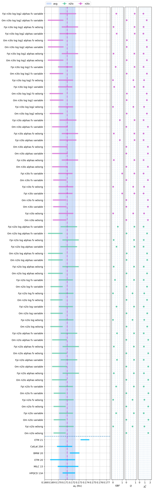
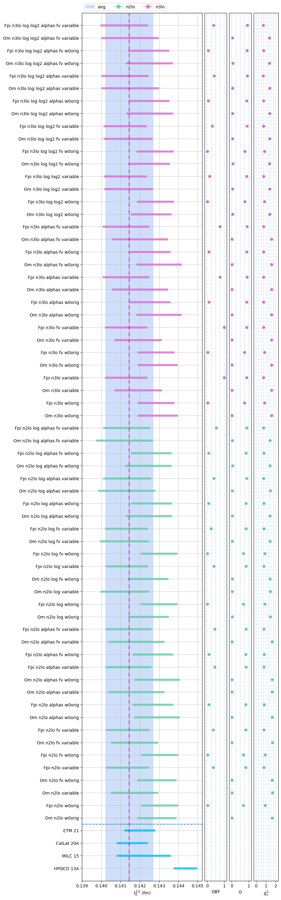
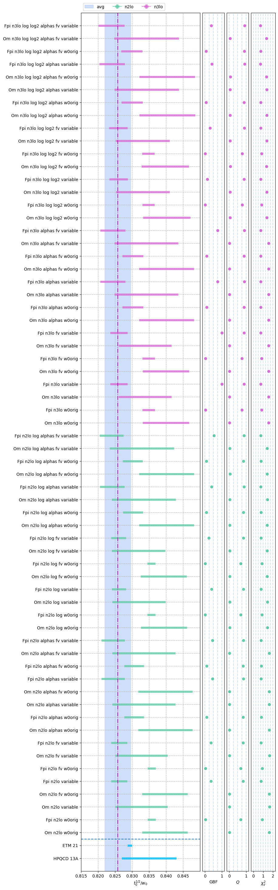
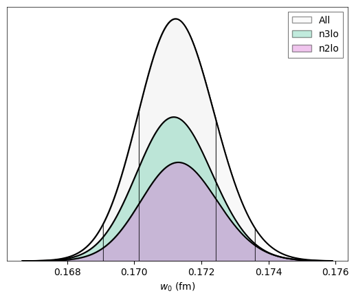
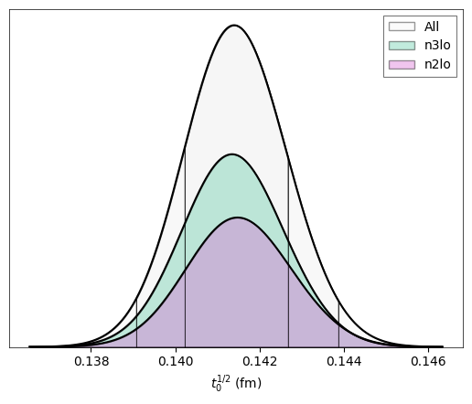
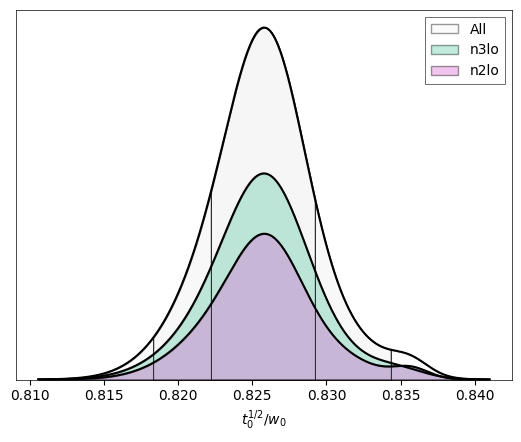
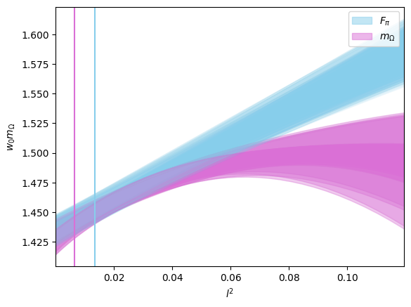
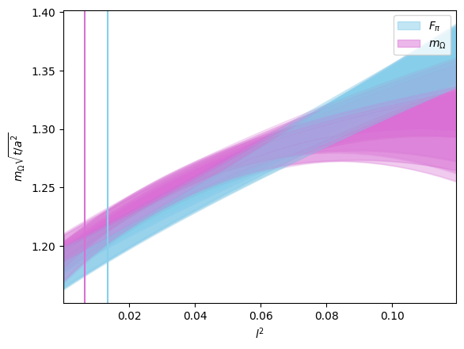

## Representative model
```yaml
Model: Fpi_n3lo_log_log2_fv_w0orig   [simultaneous]
---

w0: 0.1711(11)

  w0/a06: 2.986(12)   => a06/fm: 0.05729(48)
  w0/a09: 1.9444(55)  => a09/fm: 0.08798(67)
  w0/a12: 1.4107(29)  => a12/fm: 0.12126(86)
  w0/a15: 1.1451(12)  => a15/fm: 0.14938(98)

Error Budget:
  stat    72.7%
  disc    15.2%
  phys     9.7%
  chiral   2.4%

---

sqrt(t0): 0.14280(96)

  t0/a06^2: 6.585(25) => a06/fm: 0.05564(42)
  t0/a09^2: 3.0383(77)=> a09/fm: 0.08192(59)
  t0/a12^2: 1.7569(33)=> a12/fm: 0.10773(76)
  t0/a15^2: 1.2376(16)=> a15/fm: 0.12836(89)

Error Budget:
  stat    73.4%
  disc    14.6%
  phys     9.4%
  chiral   2.6%

---

sqrt(t0)/w0: 0.8348(18)

Error Budget:
  disc    47.9%
  stat    43.9%
  chiral   7.9%
  phys     0.4%

---

Parameters:
         w0::c0      1.106 (64)      [     1.0 (1.0) ]  
        w0::A_l       1.18 (38)      [     1.0 (1.0) ]  
        w0::A_s       1.20 (37)      [     1.0 (1.0) ]  
        w0::A_a      -0.82 (30)      [     0.0 (1.2) ]  
       w0::A_aa       0.68 (57)      [     0.0 (1.2) ]  
       w0::A_al      -1.24 (90)      [     0.0 (1.2) ]  *
       w0::A_as       0.75 (88)      [     0.0 (1.2) ]  
       w0::A_ll      -0.11 (90)      [     0.0 (1.0) ]  
       w0::A_ls       0.58 (89)      [     0.0 (1.0) ]  
       w0::A_ss      -0.56 (76)      [     0.0 (1.0) ]  
     w0::A_ll_g       0.51 (78)      [     0.0 (1.0) ]  
      w0::A_aaa      -0.52 (93)      [     0.0 (1.0) ]  
      w0::A_aal      -0.09 (97)      [     0.0 (1.0) ]  
      w0::A_aas       0.27 (96)      [     0.0 (1.0) ]  
      w0::A_all       0.03 (99)      [     0.0 (1.0) ]  
      w0::A_als      -0.31 (98)      [     0.0 (1.0) ]  
      w0::A_ass       0.46 (92)      [     0.0 (1.0) ]  
      w0::A_lll     0.02 (1.00)      [     0.0 (1.0) ]  
      w0::A_lls      -0.02 (99)      [     0.0 (1.0) ]  
      w0::A_lss       0.34 (97)      [     0.0 (1.0) ]  
      w0::A_sss      -0.62 (84)      [     0.0 (1.0) ]  
    w0::A_lll_g   0.0002 (9868)      [     0.0 (1.0) ]  
    w0::A_lls_g       0.09 (98)      [     0.0 (1.0) ]  
   w0::A_lll_gg      -0.10 (97)      [     0.0 (1.0) ]  
         t0::c0      0.871 (64)      [     1.0 (1.0) ]  
        t0::A_l       1.50 (38)      [     1.0 (1.0) ]  
        t0::A_s       1.23 (35)      [     1.0 (1.0) ]  
        t0::A_a       0.51 (38)      [     0.0 (1.8) ]  
       t0::A_aa      -2.17 (57)      [     0.0 (1.8) ]  *
       t0::A_al      -1.3 (1.1)      [     0.0 (1.8) ]  
       t0::A_as       1.6 (1.1)      [     0.0 (1.8) ]  
       t0::A_ll      -0.30 (90)      [     0.0 (1.0) ]  
       t0::A_ls       0.13 (89)      [     0.0 (1.0) ]  
       t0::A_ss      -0.69 (75)      [     0.0 (1.0) ]  
     t0::A_ll_g       0.17 (77)      [     0.0 (1.0) ]  
      t0::A_aaa       0.42 (94)      [     0.0 (1.0) ]  
      t0::A_aal      -0.18 (97)      [     0.0 (1.0) ]  
      t0::A_aas      -0.14 (97)      [     0.0 (1.0) ]  
      t0::A_all      -0.25 (99)      [     0.0 (1.0) ]  
      t0::A_als       0.08 (99)      [     0.0 (1.0) ]  
      t0::A_ass      -0.02 (94)      [     0.0 (1.0) ]  
      t0::A_lll    -0.06 (1.00)      [     0.0 (1.0) ]  
      t0::A_lls      -0.09 (99)      [     0.0 (1.0) ]  
      t0::A_lss     0.009 (972)      [     0.0 (1.0) ]  
      t0::A_sss      -0.63 (83)      [     0.0 (1.0) ]  
    t0::A_lll_g       0.11 (99)      [     0.0 (1.0) ]  
    t0::A_lls_g       0.05 (98)      [     0.0 (1.0) ]  
   t0::A_lll_gg      -0.13 (97)      [     0.0 (1.0) ]  

Least Square Fit:
  chi2/dof [dof] = 0.83 [44]    Q = 0.77    logGBF = 155.26

Settings:
  svdcut/n = 1e-12/0    tol = (1e-08,1e-10,1e-10*)    (itns/time = 11/3.7)
  fitter = scipy_least_squares    method = trf
```

### w0 interpolation
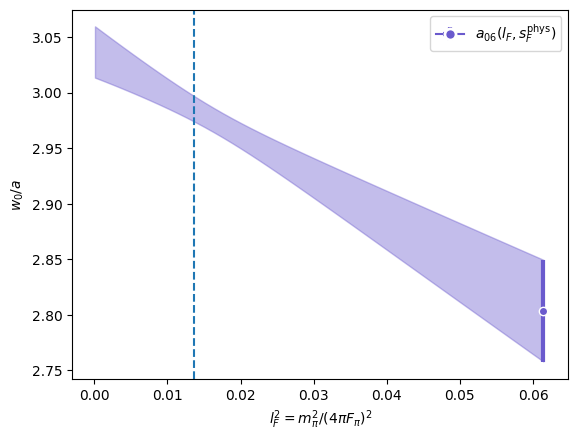

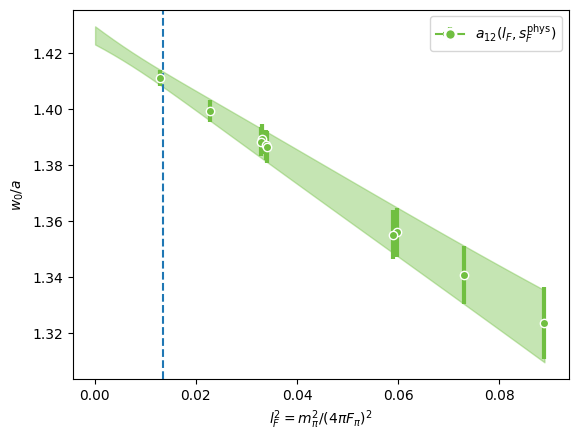
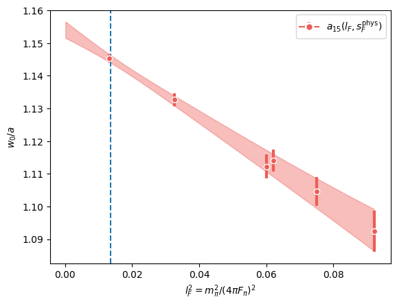

### t0 interpolation
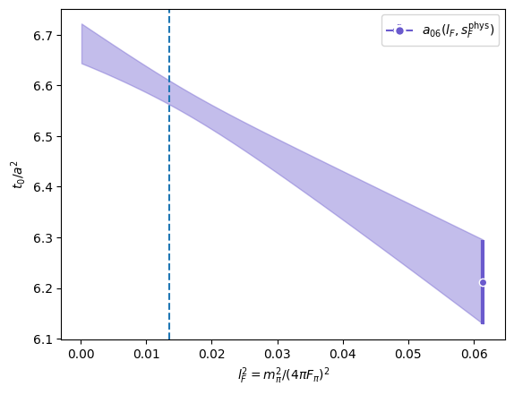
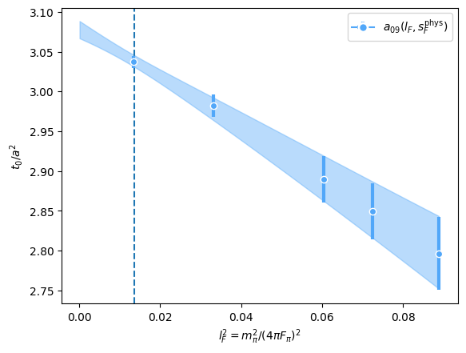
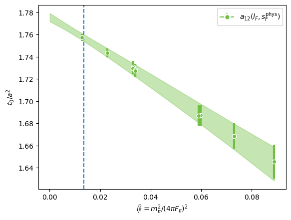
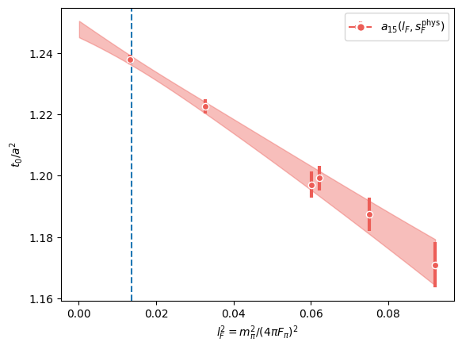

### Lattice dependence
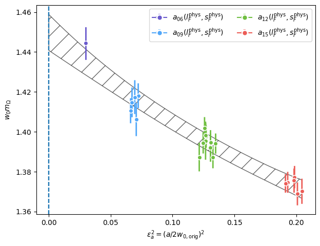
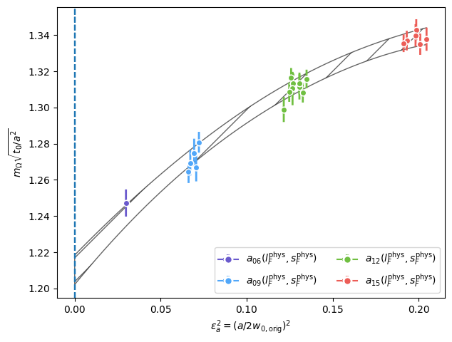

### Light quark mass dependence
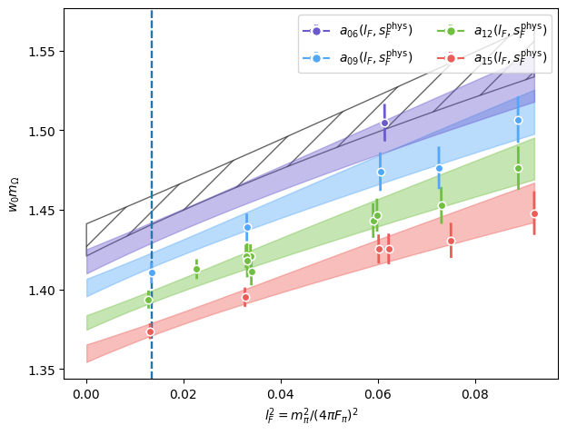
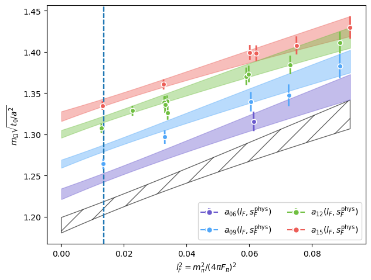

### Strange quark mass dependence
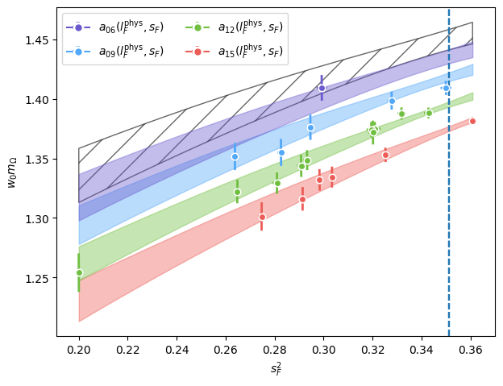
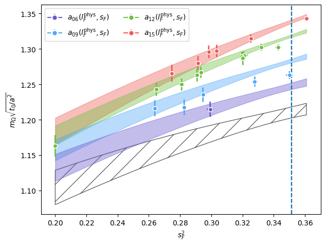
