## Autogenerated
### Priors
observable: t0 
| model | c0 | A_a | A_l | A_s | A_aa | A_al | A_as | A_ll | A_ll_g | A_ls | A_ss | A_aaa | A_aal | A_aas | A_all | A_als | A_ass | A_lll | A_lll_g | A_lll_gg | A_lls | A_lls_g | A_lss | A_sss | A_alpha |
| --- | --- | --- | --- | --- | --- | --- | --- | --- | --- | --- | --- | --- | --- | --- | --- | --- | --- | --- | --- | --- | --- | --- | --- | --- | --- |
| default_Fpi | 0 ± 5.0 | 0 ± 5.0 | 0 ± 5.0 | 0 ± 5.0 | 0 ± 5.0 | 0 ± 5.0 | 0 ± 5.0 | 0 ± 5.0 | 0 ± 5.0 | 0 ± 5.0 | 0 ± 5.0 | 0 ± 5.0 | 0 ± 5.0 | 0 ± 5.0 | 0 ± 5.0 | 0 ± 5.0 | 0 ± 5.0 | 0 ± 5.0 | 0 ± 5.0 | 0 ± 5.0 | 0 ± 5.0 | 0 ± 5.0 | 0 ± 5.0 | 0 ± 5.0 | 0 ± 0.50 |
| default_Om | 0 ± 5.0 | 0 ± 5.0 | 0 ± 5.0 | 0 ± 5.0 | 0 ± 5.0 | 0 ± 5.0 | 0 ± 5.0 | 0 ± 5.0 | 0 ± 5.0 | 0 ± 5.0 | 0 ± 5.0 | 0 ± 5.0 | 0 ± 5.0 | 0 ± 5.0 | 0 ± 5.0 | 0 ± 5.0 | 0 ± 5.0 | 0 ± 8.0 | 0 ± 8.0 | 0 ± 8.0 | 0 ± 8.0 | 0 ± 8.0 | 0 ± 8.0 | 0 ± 8.0 | 0 ± 0.50 |


observable: w0 
| model | c0 | A_a | A_l | A_s | A_aa | A_al | A_as | A_ll | A_ll_g | A_ls | A_ss | A_aaa | A_aal | A_aas | A_all | A_als | A_ass | A_lll | A_lll_g | A_lll_gg | A_lls | A_lls_g | A_lss | A_sss | A_alpha |
| --- | --- | --- | --- | --- | --- | --- | --- | --- | --- | --- | --- | --- | --- | --- | --- | --- | --- | --- | --- | --- | --- | --- | --- | --- | --- |
| default_Fpi | 0 ± 5.0 | 0 ± 5.0 | 0 ± 5.0 | 0 ± 5.0 | 0 ± 5.0 | 0 ± 5.0 | 0 ± 5.0 | 0 ± 5.0 | 0 ± 5.0 | 0 ± 5.0 | 0 ± 5.0 | 0 ± 5.0 | 0 ± 5.0 | 0 ± 5.0 | 0 ± 5.0 | 0 ± 5.0 | 0 ± 5.0 | 0 ± 5.0 | 0 ± 5.0 | 0 ± 5.0 | 0 ± 5.0 | 0 ± 5.0 | 0 ± 5.0 | 0 ± 5.0 | 0 ± 0.50 |
| default_Om | 0 ± 5.0 | 0 ± 5.0 | 0 ± 5.0 | 0 ± 5.0 | 0 ± 5.0 | 0 ± 5.0 | 0 ± 5.0 | 0 ± 5.0 | 0 ± 5.0 | 0 ± 5.0 | 0 ± 5.0 | 0 ± 5.0 | 0 ± 5.0 | 0 ± 5.0 | 0 ± 5.0 | 0 ± 5.0 | 0 ± 5.0 | 0 ± 8.0 | 0 ± 8.0 | 0 ± 8.0 | 0 ± 8.0 | 0 ± 8.0 | 0 ± 8.0 | 0 ± 8.0 | 0 ± 0.50 |


| model | c0a06 | c0a09 | c0a12 | c0a15 | k_a | k_l | k_s | k_aa | k_al | k_as | k_ll | k_ll_g | k_ls | k_ss |
| --- | --- | --- | --- | --- | --- | --- | --- | --- | --- | --- | --- | --- | --- | --- |
| t0_interpolation | 6.0(5.0) | 3.0(5.0) | 1.5(1.0) | 1.0(5.0) | 2.0(2.0) | 0 ± 2.0 | 0 ± 2.0 | 0 ± 2.0 | 0 ± 2.0 | 0 ± 2.0 | 0 ± 2.0 | 0 ± 2.0 | 0 ± 2.0 | 0 ± 2.0 |


| model | c0a06 | c0a09 | c0a12 | c0a15 | k_a | k_l | k_s | k_aa | k_al | k_as | k_ll | k_ll_g | k_ls | k_ss |
| --- | --- | --- | --- | --- | --- | --- | --- | --- | --- | --- | --- | --- | --- | --- |
| w0_interpolation | 3.0(5.0) | 2.0(5.0) | 1.5(1.0) | 1.0(5.0) | 2.0(2.0) | 0 ± 2.0 | 0 ± 2.0 | 0 ± 2.0 | 0 ± 2.0 | 0 ± 2.0 | 0 ± 2.0 | 0 ± 2.0 | 0 ± 2.0 | 0 ± 2.0 |


### Inputs
| ens | Fpi | L | a/w | a/w:impr | a/w:orig | alpha_s | mO | mk | mpi | t/a^2 | t/a^2:impr | t/a^2:orig |
| --- | --- | --- | --- | --- | --- | --- | --- | --- | --- | --- | --- | --- |
| a06m310L | 0.030366(83) | 72.000000(72) | 0.34420(24) | 0.34420(24) | 0.34533(24) | 0.29985000(30) | 0.5069(21) | 0.162049(73) | 0.094560(58) | 6.0606(44) | 6.0606(44) | 6.4079(45) |
| a09m135 | 0.04079(10) | 64.000000(64) | 0.51118(27) | 0.51118(27) | 0.51413(27) | 0.43356000(43) | 0.7244(25) | 0.218500(78) | 0.059459(63) | 2.7147(11) | 2.7147(11) | 3.0390(12) |
| a09m220 | 0.042843(79) | 48.000000(48) | 0.51577(32) | 0.51577(32) | 0.51861(31) | 0.43356000(43) | 0.7377(30) | 0.228702(91) | 0.097900(63) | 2.6952(15) | 2.6952(15) | 3.0172(16) |
| a09m310 | 0.045523(68) | 32.000000(32) | 0.52449(62) | 0.52449(62) | 0.52715(60) | 0.43356000(43) | 0.7543(36) | 0.24106(14) | 0.14072(12) | 2.6521(29) | 2.6521(29) | 2.9698(32) |
| a09m350 | 0.046632(84) | 32.000000(32) | 0.52909(72) | 0.52909(72) | 0.53164(71) | 0.43356000(43) | 0.7561(35) | 0.24696(12) | 0.15785(20) | 2.6301(34) | 2.6301(34) | 2.9455(37) |
| a09m400 | 0.048368(75) | 32.000000(32) | 0.53517(76) | 0.53517(76) | 0.53758(74) | 0.43356000(43) | 0.7716(23) | 0.25523(13) | 0.18116(15) | 2.6040(33) | 2.6040(33) | 2.9158(42) |
| a12m130 | 0.05701(11) | 48.000000(48) | 0.70366(27) | 0.70366(27) | 0.70646(26) | 0.53796000(54) | 0.9801(26) | 0.30215(11) | 0.08126(16) | 1.47486(56) | 1.47486(56) | 1.76281(66) |
| a12m180L | 0.05781(11) | 48.000000(48) | 0.70697(23) | 0.70697(23) | 0.70958(22) | 0.53796000(54) | 0.9924(26) | 0.305937(89) | 0.109624(59) | 1.46859(45) | 1.46859(45) | 1.75530(53) |
| a12m220 | 0.05870(13) | 32.000000(32) | 0.70942(54) | 0.70942(54) | 0.71189(51) | 0.53796000(54) | 0.9924(60) | 0.31001(17) | 0.13428(17) | 1.4641(12) | 1.4641(12) | 1.7498(14) |
| a12m220L | 0.05881(13) | 40.000000(40) | 0.70975(34) | 0.70975(34) | 0.71220(32) | 0.53796000(54) | 0.9944(30) | 0.31021(19) | 0.13402(15) | 1.46327(75) | 1.46327(75) | 1.74893(86) |
| a12m220S | 0.05865(16) | 24.000000(24) | 0.71080(80) | 0.71080(80) | 0.71319(76) | 0.53796000(54) | 0.9970(26) | 0.31043(22) | 0.13557(32) | 1.4614(17) | 1.4614(17) | 1.7466(20) |
| a12m220ms | 0.05732(11) | 32.000000(32) | 0.69417(60) | 0.69417(60) | 0.69739(57) | 0.53796000(54) | 0.8896(92) | 0.24639(13) | 0.13282(13) | 1.4977(13) | 1.4977(13) | 1.7891(15) |
| a12m310 | 0.06138(11) | 24.000000(24) | 0.72134(65) | 0.72134(65) | 0.72307(66) | 0.53796000(54) | 1.0112(32) | 0.32414(21) | 0.18870(17) | 1.4398(17) | 1.4398(17) | 1.7213(19) |
| a12m310XL | 0.06176(12) | 48.000000(48) | 0.72124(29) | 0.72124(29) | 0.72303(27) | 0.53796000(54) | 1.0072(41) | 0.324608(91) | 0.188574(81) | 1.44066(59) | 1.44066(59) | 1.72211(70) |
| a12m350 | 0.06299(14) | 24.000000(24) | 0.72703(56) | 0.72703(56) | 0.72846(53) | 0.53796000(54) | 1.0139(26) | 0.33306(16) | 0.21397(20) | 1.4298(12) | 1.4298(12) | 1.7091(14) |
| a12m400 | 0.06498(11) | 24.000000(24) | 0.73337(43) | 0.73337(43) | 0.73442(40) | 0.53796000(54) | 1.0279(25) | 0.34341(14) | 0.24347(16) | 1.41722(95) | 1.41722(95) | 1.6942(11) |
| a15m135XL | 0.07131(11) | 48.000000(48) | 0.88350(28) | 0.88350(28) | 0.87473(23) | 0.58801000(59) | 1.2081(19) | 0.38755(14) | 0.102929(69) | 0.98972(26) | 0.98972(26) | 1.23501(35) |
| a15m220 | 0.072768(84) | 24.000000(24) | 0.88853(63) | 0.88853(63) | 0.87889(52) | 0.58801000(59) | 1.2068(26) | 0.38690(21) | 0.16533(19) | 0.98608(66) | 0.98608(66) | 1.22978(84) |
| a15m310 | 0.075290(89) | 16.000000(16) | 0.90261(72) | 0.90261(72) | 0.89051(59) | 0.58801000(59) | 1.2312(36) | 0.40457(25) | 0.23601(29) | 0.97271(68) | 0.97271(68) | 1.21214(89) |
| a15m310L | 0.07594(14) | 24.000000(24) | 0.90369(55) | 0.90369(55) | 0.89138(45) | 0.58801000(59) | 1.2287(31) | 0.40408(22) | 0.23411(21) | 0.97198(53) | 0.97198(53) | 1.21106(69) |
| a15m350 | 0.07690(11) | 16.000000(16) | 0.9101(11) | 0.9101(11) | 0.89657(86) | 0.58801000(59) | 1.2331(31) | 0.41369(28) | 0.26473(30) | 0.9660(11) | 0.9660(11) | 1.2032(14) |
| a15m400 | 0.07938(12) | 16.000000(16) | 0.9202(12) | 0.9202(12) | 0.90469(97) | 0.58801000(59) | 1.2437(43) | 0.42723(27) | 0.30281(31) | 0.9563(11) | 0.9563(11) | 1.1905(15) |

### Model Average
```yaml
w0: 0.1705(16)

---
Uncertainty: 
   RMS model sdev:   0.00152 
   Model unc:        0.00028 

---
Error budget (RMS model sdev): 
   Statistical:  0.00130 
   Chiral:       0.00028 
   Disc:         0.00065 
   Phys point:   0.00019 

---
Highest Weight: 
   0.221:  Fpi_n2lo_alphas_variable
   0.221:  Fpi_n2lo_alphas_fv_variable
   0.079:  Fpi_n3lo_fv_variable
   0.079:  Fpi_n3lo_variable
   0.046:  Fpi_n2lo_log_alphas_variable

------
sqrt_t0: 0.1410(16)

---
Uncertainty: 
   RMS model sdev:   0.00153 
   Model unc:        0.00037 

---
Error budget (RMS model sdev): 
   Statistical:  0.00126 
   Chiral:       0.00029 
   Disc:         0.00062 
   Phys point:   0.00008 

---
Highest Weight: 
   0.221:  Fpi_n2lo_alphas_fv_variable
   0.221:  Fpi_n2lo_alphas_variable
   0.079:  Fpi_n3lo_fv_variable
   0.079:  Fpi_n3lo_variable
   0.046:  Fpi_n2lo_log_alphas_variable

------
sqrt_t0/w0: 0.8273(95)

---
Uncertainty: 
   RMS model sdev:   0.00881 
   Model unc:        0.00344 

---
Error budget (RMS model sdev): 
   Statistical:  0.00714 
   Chiral:       0.00143 
   Disc:         0.00261 
   Phys point:   0.00078 

---
Highest Weight: 
   0.221:  Fpi_n2lo_alphas_fv_variable
   0.221:  Fpi_n2lo_alphas_variable
   0.079:  Fpi_n3lo_variable
   0.079:  Fpi_n3lo_fv_variable
   0.046:  Fpi_n2lo_log_alphas_variable

------
```
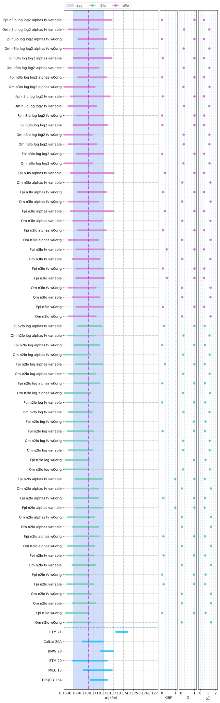
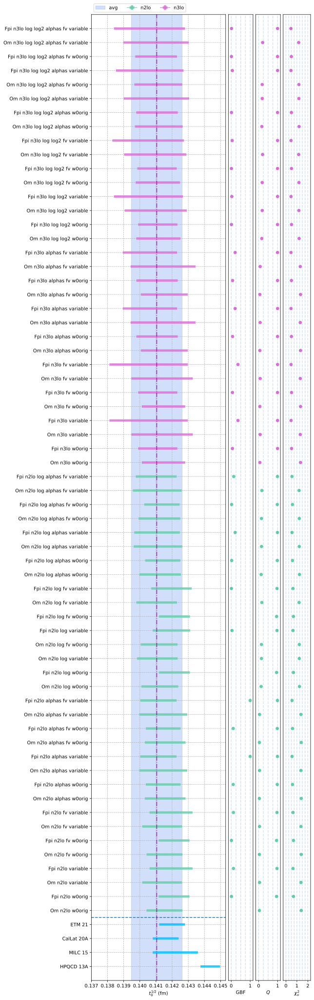
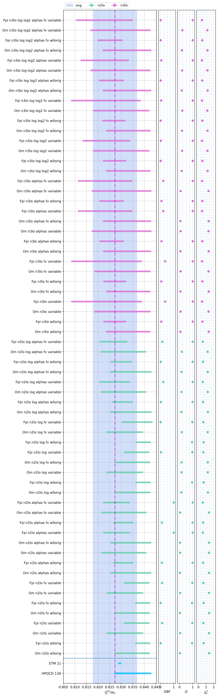
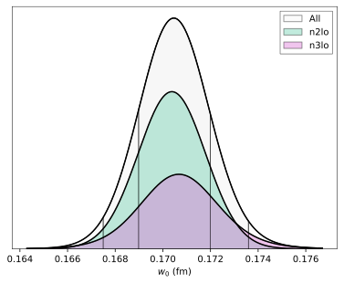
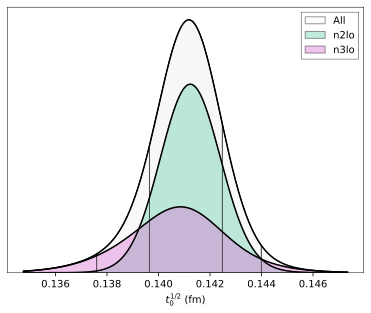
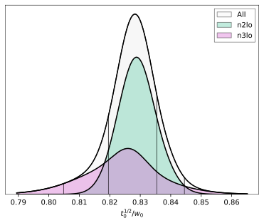
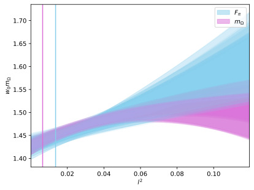
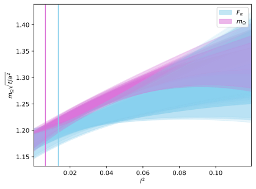

## Representative model
```yaml
Model: Fpi_n3lo_log_log2_fv_w0orig   [simultaneous]
---

w0: 0.1706(14)

  w0/a06: 2.998(12)   => a06/fm: 0.05692(55)
  w0/a09: 1.9562(55)  => a09/fm: 0.08722(79)
  w0/a12: 1.4162(30)  => a12/fm: 0.1205(11)
  w0/a15: 1.1342(14)  => a15/fm: 0.1504(13)

Error Budget:
  stat    63.2%
  disc    30.1%
  chiral   5.7%
  phys     1.0%

---

sqrt(t0): 0.1411(12)

  t0/a06^2: 6.237(27) => a06/fm: 0.05649(51)
  t0/a09^2: 2.7148(79)=> a09/fm: 0.08562(76)
  t0/a12^2: 1.4693(31)=> a12/fm: 0.1164(10)
  t0/a15^2: 0.9920(13)=> a15/fm: 0.1416(12)

Error Budget:
  stat    62.3%
  disc    31.3%
  chiral   6.0%
  phys     0.4%

---

sqrt(t0)/w0: 0.8268(50)

Error Budget:
  disc    48.6%
  stat    42.7%
  chiral   8.5%
  phys     0.2%

---

Parameters:
         w0::c0       1.01 (16)      [       0 ± 5.0 ]  
        w0::A_l       0.5 (1.6)      [       0 ± 5.0 ]  
        w0::A_s       1.9 (1.2)      [       0 ± 5.0 ]  
        w0::A_a      -0.7 (1.0)      [       0 ± 5.0 ]  
       w0::A_aa       0.7 (2.0)      [       0 ± 5.0 ]  
       w0::A_al      -2.0 (3.2)      [       0 ± 5.0 ]  
       w0::A_as       0.4 (3.3)      [       0 ± 5.0 ]  
       w0::A_ll       1.8 (3.9)      [       0 ± 5.0 ]  
       w0::A_ls       1.7 (4.1)      [       0 ± 5.0 ]  
       w0::A_ss      -1.3 (3.4)      [       0 ± 5.0 ]  
     w0::A_ll_g       0.5 (3.1)      [       0 ± 5.0 ]  
      w0::A_aaa      -5.5 (3.8)      [       0 ± 5.0 ]  *
      w0::A_aal      -0.5 (4.6)      [       0 ± 5.0 ]  
      w0::A_aas       0.9 (4.6)      [       0 ± 5.0 ]  
      w0::A_all       0.9 (4.8)      [       0 ± 5.0 ]  
      w0::A_als      -1.5 (4.7)      [       0 ± 5.0 ]  
      w0::A_ass       1.3 (4.2)      [       0 ± 5.0 ]  
      w0::A_lll       0.6 (4.9)      [       0 ± 5.0 ]  
      w0::A_lls       0.3 (4.9)      [       0 ± 5.0 ]  
      w0::A_lss       1.2 (4.7)      [       0 ± 5.0 ]  
      w0::A_sss      -2.3 (3.8)      [       0 ± 5.0 ]  
    w0::A_lll_g      -0.9 (4.8)      [       0 ± 5.0 ]  
    w0::A_lls_g       0.3 (4.7)      [       0 ± 5.0 ]  
   w0::A_lll_gg       0.6 (4.6)      [       0 ± 5.0 ]  
         t0::c0       0.78 (15)      [       0 ± 5.0 ]  
        t0::A_l       1.6 (1.5)      [       0 ± 5.0 ]  
        t0::A_s       1.9 (1.2)      [       0 ± 5.0 ]  
        t0::A_a      -0.75 (95)      [       0 ± 5.0 ]  
       t0::A_aa      -0.5 (1.9)      [       0 ± 5.0 ]  
       t0::A_al      -2.3 (3.1)      [       0 ± 5.0 ]  
       t0::A_as       2.4 (3.1)      [       0 ± 5.0 ]  
       t0::A_ll      -1.0 (3.7)      [       0 ± 5.0 ]  
       t0::A_ls      -0.8 (4.0)      [       0 ± 5.0 ]  
       t0::A_ss      -1.6 (3.3)      [       0 ± 5.0 ]  
     t0::A_ll_g      -0.6 (2.9)      [       0 ± 5.0 ]  
      t0::A_aaa       3.9 (3.5)      [       0 ± 5.0 ]  
      t0::A_aal       1.0 (4.5)      [       0 ± 5.0 ]  
      t0::A_aas      -1.7 (4.5)      [       0 ± 5.0 ]  
      t0::A_all      -1.4 (4.7)      [       0 ± 5.0 ]  
      t0::A_als       0.4 (4.6)      [       0 ± 5.0 ]  
      t0::A_ass    -0.02 (4.12)      [       0 ± 5.0 ]  
      t0::A_lll    -0.07 (4.91)      [       0 ± 5.0 ]  
      t0::A_lls      -0.6 (4.9)      [       0 ± 5.0 ]  
      t0::A_lss      -0.5 (4.6)      [       0 ± 5.0 ]  
      t0::A_sss      -1.9 (3.8)      [       0 ± 5.0 ]  
    t0::A_lll_g    -0.02 (4.76)      [       0 ± 5.0 ]  
    t0::A_lls_g       0.5 (4.6)      [       0 ± 5.0 ]  
   t0::A_lll_gg       0.6 (4.5)      [       0 ± 5.0 ]  

Least Squares Fit:
  chi2/dof [dof] = 0.51 [44]    Q = 1    logGBF = 136.59

Settings:
  svdcut/n = 1e-12/0    tol = (1e-08,1e-10,1e-10*)    (itns/time = 14/1.8s)
  fitter = scipy_least_squares    method = trf
```

### w0 interpolation
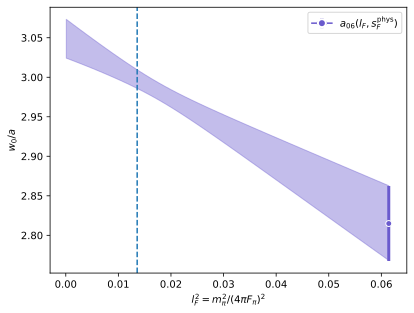
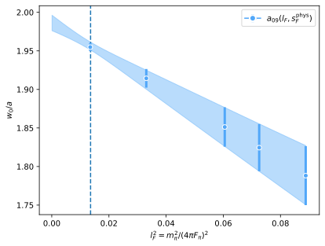

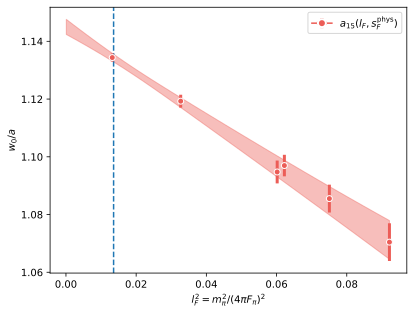

### t0 interpolation
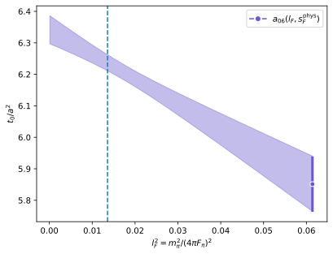
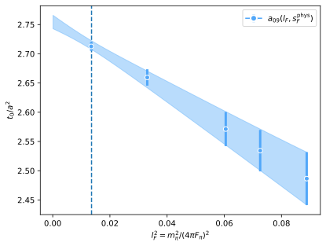
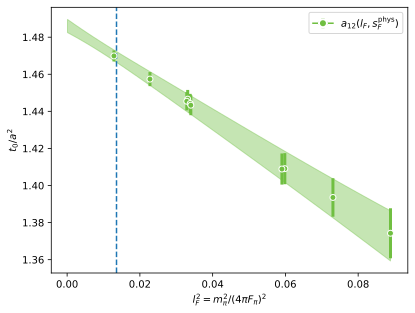
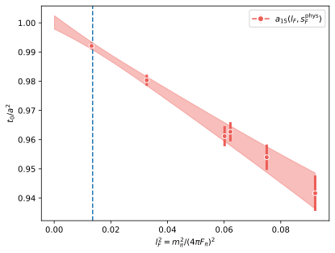

### Lattice dependence
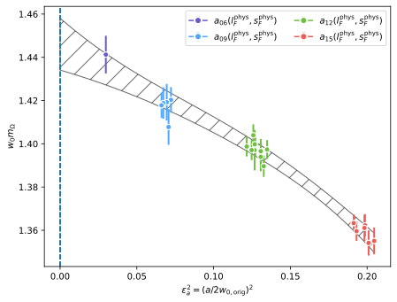
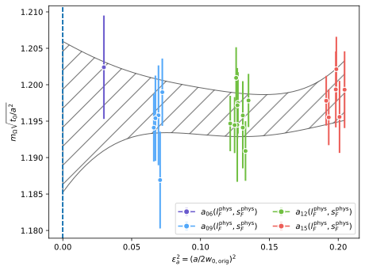

### Light quark mass dependence
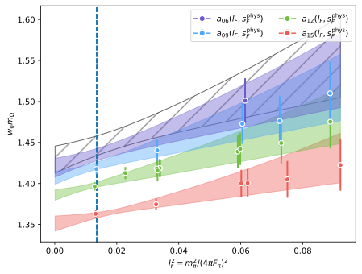


### Strange quark mass dependence
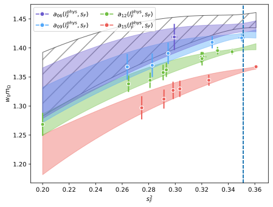

